---
hide:
  - navigation
---
[:fontawesome-solid-house:](../index.md) :fontawesome-solid-angle-right: **CREST**
# CREST

This is the webpage for containing everything to do with CREST.

CREST is an acronym for Conformer Rotamer Ensemble Sampling Tool and it uses semi-emperical methods from xTB in addition to genetic algorithms to find the lowest energy conformer for an input structure.

## CREST Documentation

The CREST Documentation is really informative and descriptive. I would recommend you take a look at it. Also you should check out the xTB documentation which is the main QM/MM calculator CREST uses. Good examples on how CREST and xTB operate are on the Grimme-Lab Workshops webpage linked below.

* CREST: [https://crest-lab.github.io/crest-docs/](https://crest-lab.github.io/crest-docs/)
* xTB: [https://xtb-docs.readthedocs.io/](https://xtb-docs.readthedocs.io/)
* Grimme-Lab Workshops: [https://grimme-lab.github.io/workshops/](https://grimme-lab.github.io/workshops/)


## How to use CREST for Conformational Sampling


## Calculation Setup and Running CREST

There are two example molecules we can try, Hexane ($\mathrm{C_{6}H_{12}}$) or Squalene ($\mathrm{C_{30}H_{50}}$). Hexane is a hydrocarbon and Squalene is an organic molecule with two possible ways to draw it on a 2D surface. Both molecules have many rotatable C-C bonds with each bond rotation being multiple possible different conformations. The Hexane CREST calculation will finish alot faster than the Squalene CREST calculation.

=== "SMILE Strings"

    SMILE String for Hexane:

    ```
    CCCCCC

    ```

    SMILE String for Squalene:

    ```
    CC(=CCC/C(=C/CC/C(=C/CC/C=C(/CC/C=C(/CCC=C(C)C)\C)\C)/C)/C)C

    ```

=== "Hexane Image"
    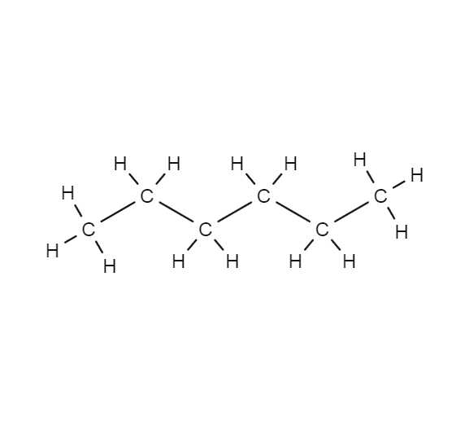

    From [https://encyclopedia.airliquide.com/hexane](https://encyclopedia.airliquide.com/hexane)

=== "Squalene Image 1"
    

    From [https://www.sigmaaldrich.com/US/en/product/mm/821068](https://www.sigmaaldrich.com/US/en/product/mm/821068)

=== "Squalene Image 2"
    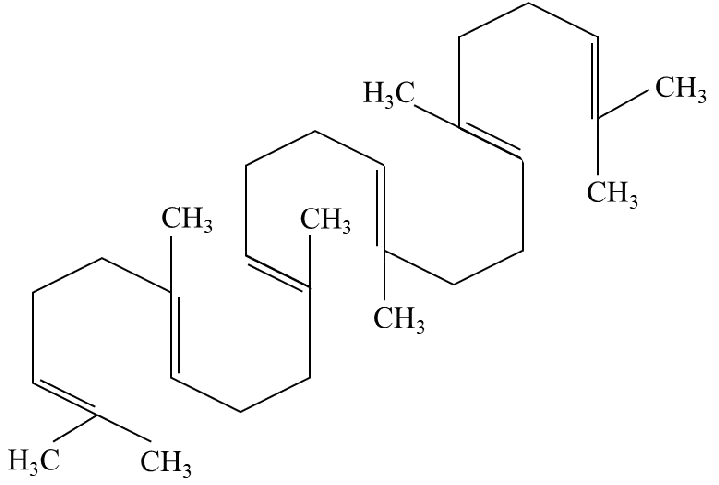

    From [https://www.researchgate.net/figure/Squalene-chemical-structure-Squalene-is-a-natural-dehydrotriterpenic-hydrocarbon-C-30-H_fig2_335133970](https://www.researchgate.net/figure/Squalene-chemical-structure-Squalene-is-a-natural-dehydrotriterpenic-hydrocarbon-C-30-H_fig2_335133970)

For CREST to run, we need an initial .xyz structure. Lets generate it using the [RDKit](https://www.rdkit.org/docs/api-docs.html) library and the SMILE string of Squalene. Run the below code either in a python file or the python kernel.

``` python 
from rdkit import Chem
from rdkit.Chem import AllChem
import os

# For Squalene
smile_string = r"CC(=CCC/C(=C/CC/C(=C/CC/C=C(/CC/C=C(/CCC=C(C)C)\C)\C)/C)/C)C" #we placed r before the string to make it a raw string because of the backslashes present in the smile string. without the r and python could interpret them as special characters.
xyz_filename = "squalene_initial.xyz" #file you want the molecule to be saved to.

# For Hexane
smile_string = "CCCCCC"
xyz_filename = "hexane_initial.xyz" #file you want the molecule to be saved to.

#Main RDkit code for SMILE generation to a .xyz file
rdkit_mol = Chem.AddHs(Chem.MolFromSmiles(smile_string)) #generates a 2d rdkit_mol object and adds Hydrogens where it is not specified in the SMILE string
AllChem.EmbedMolecule(rdkit_mol) #makes the 2d rdkit_mol object into a 3d rdkit_mol object
Chem.MolToXYZFile(rdkit_mol, os.path.join(os.getcwd(), xyz_filename)) #saves rdkit_mol object to a file in an .xyz format

```

CREST documentation reccomends to pre optimize the initial structure using the same level of theory we will use in CREST so, lets first run xTB to optimize squalene_initial.xyz. Let's run this command in a new directory. Also xTB, is downloaded when we install CREST so we can use the same conda environment or use our xTB conda environment.

```
xtb squalene_initial.xyz --charge 0 --gfn 2 --molden --opt > xtb.out
cp xtbopt.xyz initial_opt.xyz

```

Now lets run CREST! After you create a new directory with the initial_opt.xyz file located inside, run the SLURM script named "run_crest.sh" which is located [HERE](https://jerschro.github.io/how_to_dft/crest/#slurm-script-for-crest). The command where CREST is envoked is ```crest initial_opt.xyz --gfn2 -T 36 > crest.out```. Then submit the SLURM script to SLURM using the command ```sbatch run_crest.sh```.


## SLURM Script for CREST

This SLURM script sources CREST for you so you do not need to install it using conda.

``` bash title="run_crest.sh"
#!/bin/bash
#SBATCH --job-name=CREST_job
#SBATCH --time=12:00:00
#SBATCH -p quanah
#SBATCH -N 1
#SBATCH -n 36
#SBATCH --mem-per-cpu=1G
#SBATCH -o slurm.o-%j
#SBATCH -e slurm.e-%j

shopt -s extglob; ulimit -s unlimited; 

home=$SLURM_SUBMIT_DIR; START_TIME=$(date); cd $SLURM_SUBMIT_DIR; 
keepFileList=" OUTCAR mos alpha beta *.in *.inp XDATCAR "

JOBTYPE="CREST"
WRKDIR=/lustre/scratch/$USER/$JOBTYPE/$SLURM_JOB_ID
#WRKDIR=/lustre/work/$USER/$JOBTYPE/$SLURM_JOB_ID

[ -z $WRKDIR ] && [ -z $JOBTYPE ] && exit;
[[ $JOBTYPE == "XTB" ]] && [[ ! "$SLURM_NTASKS" == "1" ]] && exit;
mkdir -p $WRKDIR

echo "JOB-TYPE: " $JOBTYPE; 		echo "Job ID: " $SLURM_JOB_ID
echo "Start Time: " $START_TIME; 	echo "Submit Directory:  " $SLURM_SUBMIT_DIR
echo "Work Directory: " $WRKDIR

#JOB--------------------------------------------------------------------

if [ ! -f initial_opt.xyz ]
then
  echo "NO initial_opt.xyz file exists. exiting!!!"
  exit
fi

cp $SLURM_SUBMIT_DIR/!(slurm*) $WRKDIR -pf
ln -s $WRKDIR 0.$JOBTYPE-$SLURM_JOB_ID; cd $WRKDIR; 

#CREST
source /home/jerschro/conda/etc/profile.d/conda.sh
export PATH=/home/jerschro/conda/bin:$PATH

/home/jerschro/conda/envs/crest/bin/crest initial_opt.xyz --gfn2 -T 36 > crest.out


#EXIT--------------------------------------------------------------------

cd $WRKDIR; smallSlurm="`find slurm* -maxdepth 1 -size -50w`" 2> /dev/null; 
rm -f $smallSlurm; keepFileList="$keepFileList *.out *.log"; 
if [[ -f $WRKDIR ]] && [[ -f $SLURM_SUBMIT_DIR ]]; then
	cd $WRKDIR;
	for i in $keepFileList; do 
		[ -f $i ] && mv -f $i $SLURM_SUBMIT_DIR; 
	done
	largeFiles="`find . -maxdepth 1 -size +80M`"
	for j in $largeFiles; do 
		rm -f $j 
	done
fi
cp -pf $WRKDIR/* $SLURM_SUBMIT_DIR 2> /dev/null; cd $SLURM_SUBMIT_DIR
[ -z $largeFiles ] && echo -e "\nRemoved Files:\n"$largeFiles
echo -e "\nKept Files:\n"$keepFileList

#-----------------------------------------------------------------------
END_TIME=$(date) 
time_diff=$(($(date -d "$END_TIME" +%s) - $(date -d "$START_TIME" +%s)))
time_diff=$(date -u -d @"$time_diff" +'%H:%M:%S')
echo "End Time: " $END_TIME; echo "Total Calculation Time: " $time_diff
#-----------------------------------------------------------------------

```


<!-- 

**PLEASE USE THE SLURM SCRIPT [HERE](https://jerschro.github.io/how_to_dft/crest/#slurm-script-for-crest). RUNNING CREST IN THE COMMAND LINE IS VERY SLOW** Run the command below in a new directory or sbatch the SLURM script below. We can add `> crest.out` to the command to direct the stdout to a file so we can save the CREST terminal output. The default algorithim CREST uses is the iMTD-GC algorithim which is explained [HERE](https://crest-lab.github.io/crest-docs/page/overview/workflows.html#imtd-gc-algorithm). We can add a solvent model with this flag `--gbsa hexane`. You can specify the amount of CPU Threads (on HPCC we call it ntasks) by using flag `-T 36` for 36 ntasks on quanah for example. 

* NOTE: If you see an OpenBLAS Warning, it is OKAY, xTB has this warning and I believe it comes from how we installed xTB through conda. The xTB and CREST calculation will still work fine to my knowledge.

```
crest initial_opt.xyz --gfn2 -T 36 > crest.out

``` 

-->


## Looking at the Output Files CREST Generates

The list below is what files CREST generates for a conformational sampling. Important files are listed below and the rest are in the table:

* **crest_best.xyz** - the lowest energy conformer that CREST found.
* **crest_conformers.xyz** - has all of the conformers listed that CREST found.
* **crest_rotamers.xyz** - has all of the rotamers listed that CREST found. It contains all of the conformers in crest_conformers.xyz and all of the rotamers CREST found for each conformer.
* **crest.out** - the terminal output of CREST.

<table>
    <tr><td>confcross.xyz</td><td>coord</td><td>cre_members</td></tr>
    <tr><td>crest_0.mdrestart</td><td>crest_dynamics.trj</td><td>crest.energies</td></tr>
    <tr><td>crest_input_copy.xyz</td><td>crestopt.log</td><td>crest.restart</td></tr>
    <tr><td>crest_rotamers.xyz</td><td>ensemble_energies.log</td><td>gfnff_adjacency</td></tr>
    <tr><td>gfnff_topo</td><td>initial_opt.xyz</td><td>wbo</td></tr>
</table>

## What CREST Does

Looking at our example of Hexane. CREST takes the initial structure we give it and determines the bonds and connectivity seen in the .xyz file. The algorithms CREST uses are described in more detail in this paper linked [TTU Library Link](https://ttu-primo.hosted.exlibrisgroup.com/permalink/f/1j33bpi/TN_cdi_crossref_primary_10_1039_C9CP06869D). The below slideshow shows the initial structure and the best structure CREST found.


=== "Initial Structure"
    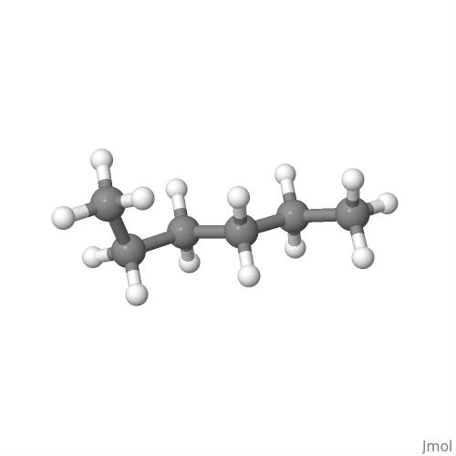

    This is the initial structure we generated from the SMILE string using RDKit. This is the structure we used as input to CREST.

=== "CREST Best"
    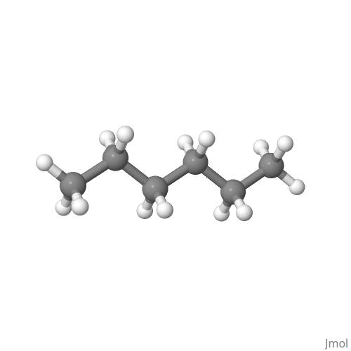

    This structure is the lowest energy structure CREST found. It is equivalent to Conformer 1 of CREST.


The Below Slideshow shows all of the different Conformations CREST produced for Hexane. All of these structures are from the crest_conformers.xyz file in the original order it produced.

=== "Conformer 1"
    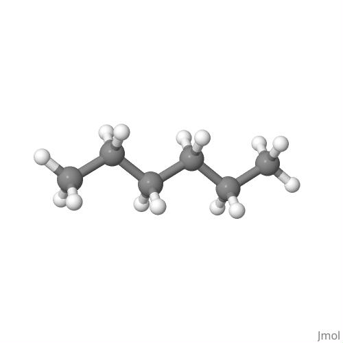

    **Conformer 1**

    $\mathrm{E_Total}$ = -19.993838 $\mathrm{E_h}$

    $\Delta\mathrm{E_{gs}}$ = $\mathrm{E_{1}-E_1}$= 0.000000 $\mathrm{E_h}$ = 0.000000 $\mathrm{eV}$ = 0.000000 $\mathrm{\frac{kcal}{mol}}$ = 0.000000 $\mathrm{\frac{kJ}{mol}}$

=== "Conformer 2"
    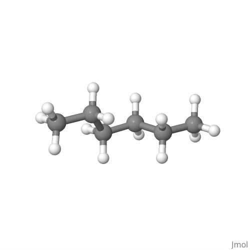

    **Conformer 2**

    $\mathrm{E_Total}$ = -19.992963 $\mathrm{E_h}$

    $\Delta\mathrm{E_{gs}}$ = $\mathrm{E_{2}-E_1}$= 0.000875 $\mathrm{E_h}$ = 0.023629 $\mathrm{eV}$ = 0.551332 $\mathrm{\frac{kcal}{mol}}$ = 2.275338 $\mathrm{\frac{kJ}{mol}}$

=== "Conformer 3"
    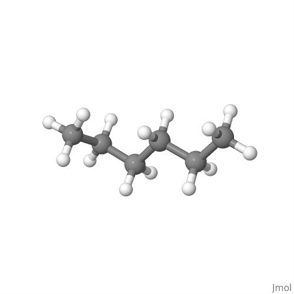

    **Conformer 3**

    $\mathrm{E_Total}$ = -19.992925 $\mathrm{E_h}$

    $\Delta\mathrm{E_{gs}}$ = $\mathrm{E_{3}-E_1}$= 0.000913 $\mathrm{E_h}$ = 0.024638 $\mathrm{eV}$ = 0.574881 $\mathrm{\frac{kcal}{mol}}$ = 2.372526 $\mathrm{\frac{kJ}{mol}}$

=== "Conformer 4"
    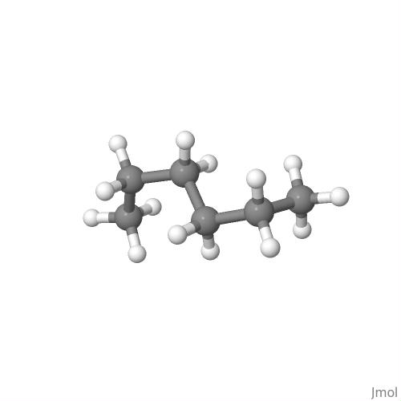

    **Conformer 4**

    $\mathrm{E_Total}$ = -19.992111 $\mathrm{E_h}$

    $\Delta\mathrm{E_{gs}}$ = $\mathrm{E_{4}-E_1}$= 0.001726 $\mathrm{E_h}$ = 0.046615 $\mathrm{eV}$ = 1.087682 $\mathrm{\frac{kcal}{mol}}$ = 4.488848 $\mathrm{\frac{kJ}{mol}}$

=== "Conformer 5"
    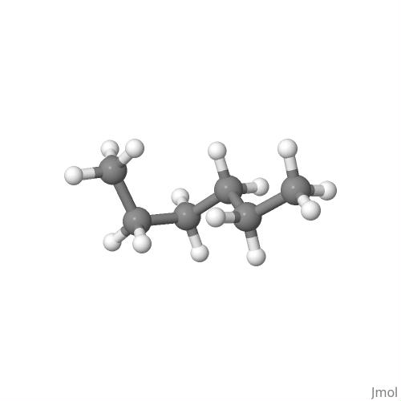

    **Conformer 5**

    $\mathrm{E_Total}$ = -19.992034 $\mathrm{E_h}$

    $\Delta\mathrm{E_{gs}}$ = $\mathrm{E_{5}-E_1}$= 0.001804 $\mathrm{E_h}$ = 0.048703 $\mathrm{eV}$ = 1.136407 $\mathrm{\frac{kcal}{mol}}$ = 4.689932 $\mathrm{\frac{kJ}{mol}}$

=== "Conformer 6"
    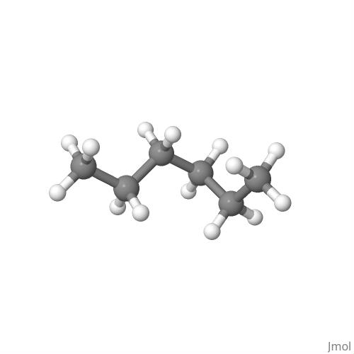

    **Conformer 6**

    $\mathrm{E_Total}$ = -19.991982 $\mathrm{E_h}$

    $\Delta\mathrm{E_{gs}}$ = $\mathrm{E_{6}-E_1}$= 0.001856 $\mathrm{E_h}$ = 0.050113 $\mathrm{eV}$ = 1.169299 $\mathrm{\frac{kcal}{mol}}$ = 4.825678 $\mathrm{\frac{kJ}{mol}}$

=== "Conformer 7"
    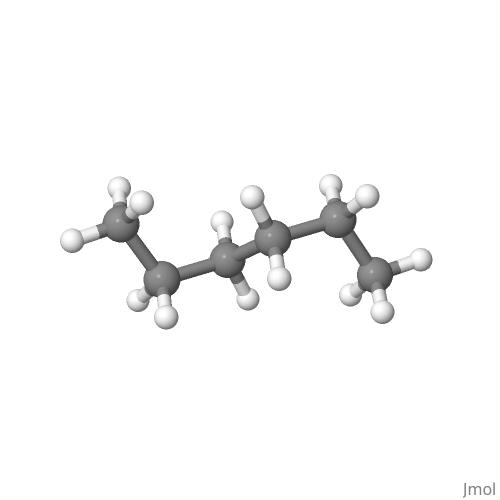

    **Conformer 7**

    $\mathrm{E_Total}$ = -19.991885 $\mathrm{E_h}$

    $\Delta\mathrm{E_{gs}}$ = $\mathrm{E_{7}-E_1}$= 0.001953 $\mathrm{E_h}$ = 0.052718 $\mathrm{eV}$ = 1.230088 $\mathrm{\frac{kcal}{mol}}$ = 5.076552 $\mathrm{\frac{kJ}{mol}}$

=== "Conformer 8"
    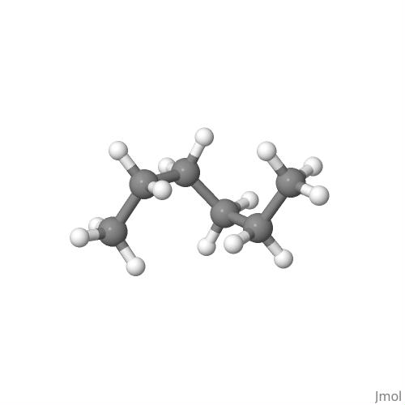

    **Conformer 8**

    $\mathrm{E_Total}$ = -19.991154 $\mathrm{E_h}$

    $\Delta\mathrm{E_{gs}}$ = $\mathrm{E_{8}-E_1}$= 0.002684 $\mathrm{E_h}$ = 0.072464 $\mathrm{eV}$ = 1.690838 $\mathrm{\frac{kcal}{mol}}$ = 6.978062 $\mathrm{\frac{kJ}{mol}}$

=== "Conformer 9"
    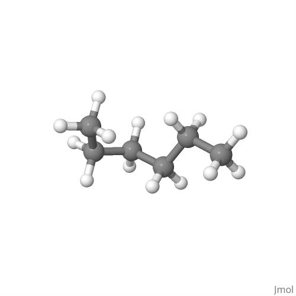

    **Conformer 9**

    $\mathrm{E_Total}$ = -19.990123 $\mathrm{E_h}$

    $\Delta\mathrm{E_{gs}}$ = $\mathrm{E_{9}-E_1}$= 0.003715 $\mathrm{E_h}$ = 0.100303 $\mathrm{eV}$ = 2.340406 $\mathrm{\frac{kcal}{mol}}$ = 9.658818 $\mathrm{\frac{kJ}{mol}}$

=== "Conformer 10"
    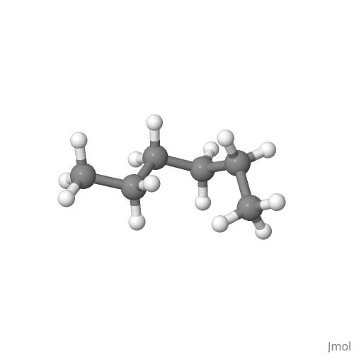

    **Conformer 10**

    $\mathrm{E_Total}$ = -19.990069 $\mathrm{E_h}$

    $\Delta\mathrm{E_{gs}}$ = $\mathrm{E_{10}-E_1}$= 0.003769 $\mathrm{E_h}$ = 0.101760 $\mathrm{eV}$ = 2.374401 $\mathrm{\frac{kcal}{mol}}$ = 9.799114 $\mathrm{\frac{kJ}{mol}}$

=== "Conformer 11"
    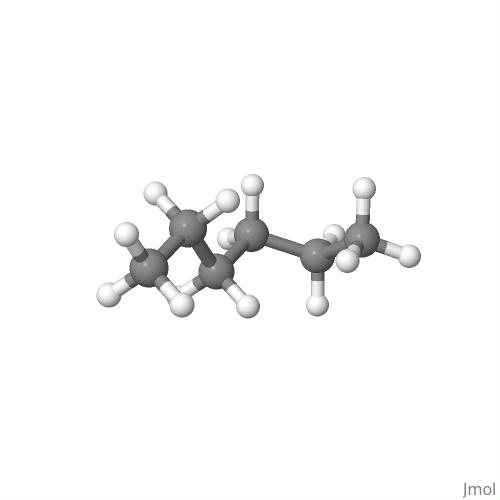

    **Conformer 11**

    $\mathrm{E_Total}$ = -19.989594 $\mathrm{E_h}$

    $\Delta\mathrm{E_{gs}}$ = $\mathrm{E_{11}-E_1}$= 0.004244 $\mathrm{E_h}$ = 0.114593 $\mathrm{eV}$ = 2.673846 $\mathrm{\frac{kcal}{mol}}$ = 11.034920 $\mathrm{\frac{kJ}{mol}}$

=== "Conformer 12"
    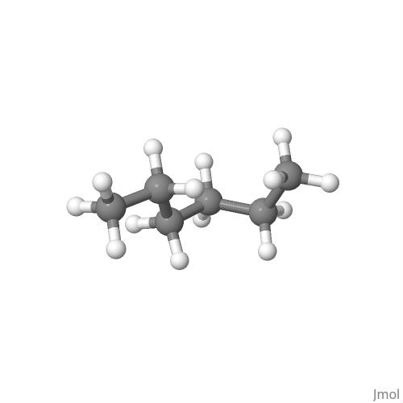

    **Conformer 12**

    $\mathrm{E_Total}$ = -19.989445 $\mathrm{E_h}$

    $\Delta\mathrm{E_{gs}}$ = $\mathrm{E_{12}-E_1}$= 0.004393 $\mathrm{E_h}$ = 0.118606 $\mathrm{eV}$ = 2.767464 $\mathrm{\frac{kcal}{mol}}$ = 11.421280 $\mathrm{\frac{kJ}{mol}}$

=== "Conformer 13"
    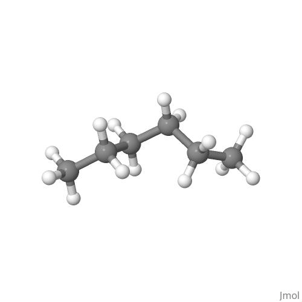

    **Conformer 13**

    $\mathrm{E_Total}$ = -19.989391 $\mathrm{E_h}$

    $\Delta\mathrm{E_{gs}}$ = $\mathrm{E_{13}-E_1}$= 0.004447 $\mathrm{E_h}$ = 0.120066 $\mathrm{eV}$ = 2.801541 $\mathrm{\frac{kcal}{mol}}$ = 11.561914 $\mathrm{\frac{kJ}{mol}}$

=== "Conformer 14"
    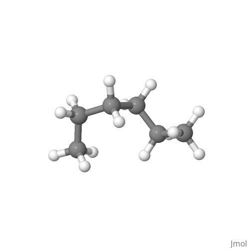

    **Conformer 14**

    $\mathrm{E_Total}$ = -19.989332 $\mathrm{E_h}$

    $\Delta\mathrm{E_{gs}}$ = $\mathrm{E_{14}-E_1}$= 0.004506 $\mathrm{E_h}$ = 0.121660 $\mathrm{eV}$ = 2.838742 $\mathrm{\frac{kcal}{mol}}$ = 11.715444 $\mathrm{\frac{kJ}{mol}}$

=== "Conformer 15"
    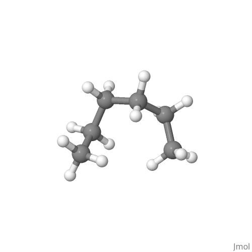

    **Conformer 15**

    $\mathrm{E_Total}$ = -19.989165 $\mathrm{E_h}$

    $\Delta\mathrm{E_{gs}}$ = $\mathrm{E_{15}-E_1}$= 0.004673 $\mathrm{E_h}$ = 0.126168 $\mathrm{eV}$ = 2.943921 $\mathrm{\frac{kcal}{mol}}$ = 12.149514 $\mathrm{\frac{kJ}{mol}}$

=== "Conformer 16"
    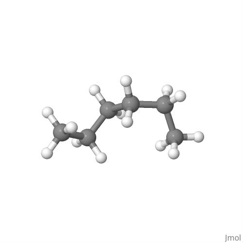

    **Conformer 16**

    $\mathrm{E_Total}$ = -19.989108 $\mathrm{E_h}$

    $\Delta\mathrm{E_{gs}}$ = $\mathrm{E_{16}-E_1}$= 0.004730 $\mathrm{E_h}$ = 0.127702 $\mathrm{eV}$ = 2.979705 $\mathrm{\frac{kcal}{mol}}$ = 12.297194 $\mathrm{\frac{kJ}{mol}}$

=== "Conformer 17"
    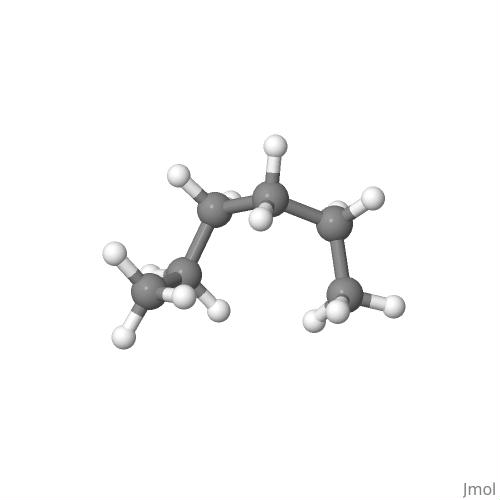

    **Conformer 17**

    $\mathrm{E_Total}$ = -19.988352 $\mathrm{E_h}$

    $\Delta\mathrm{E_{gs}}$ = $\mathrm{E_{17}-E_1}$= 0.005486 $\mathrm{E_h}$ = 0.148125 $\mathrm{eV}$ = 3.456243 $\mathrm{\frac{kcal}{mol}}$ = 14.263860 $\mathrm{\frac{kJ}{mol}}$

=== "Conformer 18"
    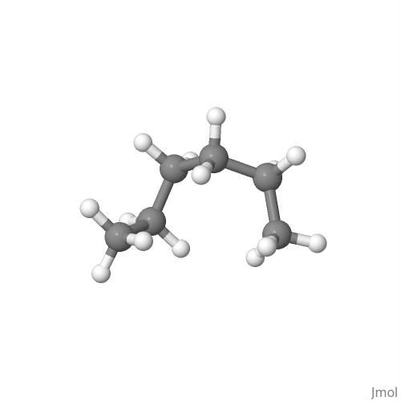

    **Conformer 18**

    $\mathrm{E_Total}$ = -19.988347 $\mathrm{E_h}$

    $\Delta\mathrm{E_{gs}}$ = $\mathrm{E_{18}-E_1}$= 0.005490 $\mathrm{E_h}$ = 0.148242 $\mathrm{eV}$ = 3.458990 $\mathrm{\frac{kcal}{mol}}$ = 14.275196 $\mathrm{\frac{kJ}{mol}}$

=== "Conformer 19"
    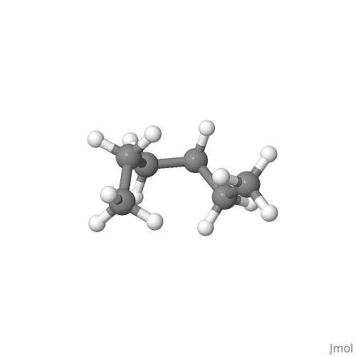

    **Conformer 19**

    $\mathrm{E_Total}$ = -19.986849 $\mathrm{E_h}$

    $\Delta\mathrm{E_{gs}}$ = $\mathrm{E_{19}-E_1}$= 0.006989 $\mathrm{E_h}$ = 0.188705 $\mathrm{eV}$ = 4.403114 $\mathrm{\frac{kcal}{mol}}$ = 18.171582 $\mathrm{\frac{kJ}{mol}}$

=== "Conformer 20"
    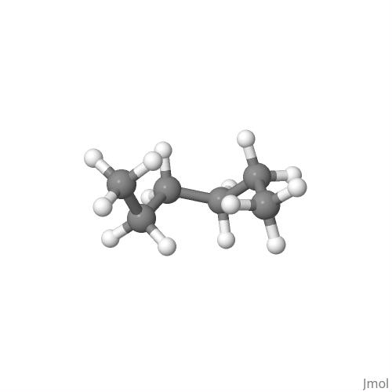

    **Conformer 20**

    $\mathrm{E_Total}$ = -19.986350 $\mathrm{E_h}$

    $\Delta\mathrm{E_{gs}}$ = $\mathrm{E_{20}-E_1}$= 0.007488 $\mathrm{E_h}$ = 0.202172 $\mathrm{eV}$ = 4.717346 $\mathrm{\frac{kcal}{mol}}$ = 19.468410 $\mathrm{\frac{kJ}{mol}}$


All of the Structures shown above are viable Hexane conformations and you can notice that the $\Delta\mathrm{E_{gs}}$ increases across the conformers.

So now we can be confident in continuing with the crest_best.xyz structure to use in further studies and calculations.


## How to Install CREST using conda

* If you are on Windows and have Anaconda/miniconda installed, go to search bar, look for "Anaconda Prompt" and open it. We can run CREST locally in this terminal.

* If you are on Mac or Linux and you have conda/miniconda installed, open the terminal. We can run CREST locally in this terminal.

* If you are on the HPCC, make sure you have conda installed. When you run crest, you need to run it either in an SLURM script (that you sbatch to run) or on an interactive node which you can do so by running the command below ```salloc -p quanah -N 1 -n 36 -t 60```. This salloc command will request and give you a full interactive node on quanah (36 ntasks) for 1 hour (60 minutes). **DO NOT RUN CREST ON THE LOGIN NODES ON THE HPCC!!! IF YOU DO THIS, 1) IT IS ILLEGAL and 2) IT MAKES IT SLOW FOR EVERYONE ELSE USING THE HPCC. PLEASE USE THE SLURM SCRIPT [HERE](https://jerschro.github.io/how_to_dft/crest/#slurm-script-for-crest). RUNNING CREST IN THE COMMAND LINE IS VERY SLOW**

If you need to install conda, read my install conda tutorial [Here](../hpcc/install_conda.md).

For all operating systems, run the commands below. This command creates a new conda environment named crest with CREST and xTB downloaded in it. To activate the conda environment and load CREST you type ```conda activate crest```.

``` conda
conda create -n crest conda-forge::crest

```

To know if you crest is loaded. You should see (crest) on the left of the terminal prompt line, such as the example below.

``` bash
(crest) jeremy@CPU-NAME:~$

```

