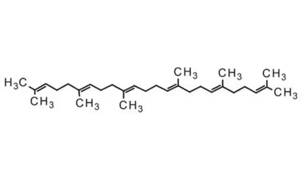

---
hide:
  - navigation
---
[:fontawesome-solid-house:](../index.md) :fontawesome-solid-angle-right: **CREST**
# CREST

This is the webpage for containing everything to do with CREST.


Introduction paragraph to crest.

## CREST Documentation

The CREST Documentation is really informative and descriptive. I would recommend you take a look at it. Also you should check out the xTB documentation which is the main QM/MM calculator CREST uses.

* CREST: [https://crest-lab.github.io/crest-docs/](https://crest-lab.github.io/crest-docs/)
* xTB: [https://xtb-docs.readthedocs.io/](https://xtb-docs.readthedocs.io/)

## How to Install CREST using conda

* If you are on Windows and have Anaconda/miniconda installed, go to search bar, look for "Anaconda Prompt" and open it. We can run CREST locally in this terminal.

* If you are on Mac or Linux and you have conda/miniconda installed, open the terminal. We can run CREST locally in this terminal.

* If you are on the HPCC, make sure you have conda installed. When you run crest, you need to run it either in an SLURM script (that you sbatch to run) or on an interactive node which you can do so by running the command below ```salloc -p quanah -N 1 -n 36 -t 60```. This salloc command will request and give you a full interactive node on quanah (36 ntasks) for 1 hour (60 minutes). **DO NOT RUN CREST ON THE LOGIN NODES ON THE HPCC!!! IF YOU DO THIS, 1) IT IS ILLEGAL and 2) IT MAKES IT SLOW FOR EVERYONE ELSE USING THE HPCC.**

If you need to install conda, read my install conda tutorial [Here](../hpcc/install_conda.md).

For all operating systems, run the commands below. This command creates a new conda environment named crest with CREST and xTB downloaded in it. To activate the conda environment and load CREST you type ```conda activate crest```.

``` conda
conda create -n crest conda-forge::crest

```

To know if you crest is loaded. You should see (crest) on the left of the terminal prompt line, such as the example below.

``` bash
(crest) jeremy@CPU-NAME:~$

```

## How to use CREST for Conformational Sampling


### Calculation Setup and Running CREST

There are two example molecules we can try, Hexane ($\mathrm{C_{6}H_{12}}$) or Squalene ($\mathrm{C_{30}H_{50}}$). Hexane is a hydrocarbon and Squalene is an organic molecule with two possible ways to draw it on a 2D surface. Both molecules have many rotatable C-C bonds with each bond rotation being multiple possible different conformations. The Hexane CREST calculation will finish alot faster than the Squalene CREST calculation.

=== "SMILE Strings"

    SMILE String for Hexane:

    ```
    CCCCCC

    ```

    SMILE String for Squalene:

    ```
    CC(=CCC/C(=C/CC/C(=C/CC/C=C(/CC/C=C(/CCC=C(C)C)\C)\C)/C)/C)C

    ```


=== "Squalene Image 1"
    

    From [https://www.sigmaaldrich.com/US/en/product/mm/821068](https://www.sigmaaldrich.com/US/en/product/mm/821068)

=== "Squalene Image 2"
    

    From [https://www.researchgate.net/figure/Squalene-chemical-structure-Squalene-is-a-natural-dehydrotriterpenic-hydrocarbon-C-30-H_fig2_335133970](https://www.researchgate.net/figure/Squalene-chemical-structure-Squalene-is-a-natural-dehydrotriterpenic-hydrocarbon-C-30-H_fig2_335133970)


For CREST to run, we need an initial .xyz structure. Lets generate it using the [RDKit](https://www.rdkit.org/docs/api-docs.html) library and the SMILE string of Squalene. Run the below code either in a python file or the python kernel.

``` python 
from rdkit import Chem
from rdkit.Chem import AllChem
import os
# For Squalene
smile_string = r"CC(=CCC/C(=C/CC/C(=C/CC/C=C(/CC/C=C(/CCC=C(C)C)\C)\C)/C)/C)C" #we placed r before the string to make it a raw string because of the backslashes present in the smile string. without the r and python could interpret them as special characters.
xyz_filename = "squalene_initial.xyz" #file you want the molecule to be saved to.

# For Hexane
smile_string = "CCCCCC"
xyz_filename = "hexane_initial.xyz" #file you want the molecule to be saved to.

#Main RDkit code for SMILE generation to a .xyz file
rdkit_mol = Chem.AddHs(Chem.MolFromSmiles(smile_string)) #generates a 2d rdkit_mol object and adds Hydrogens where it is not specified in the SMILE string
AllChem.EmbedMolecule(rdkit_mol) #makes the 2d rdkit_mol object into a 3d rdkit_mol object
Chem.MolToXYZFile(rdkit_mol, os.path.join(os.getcwd(), xyz_filename)) #saves rdkit_mol object to a file in an .xyz format

```

CREST documentation reccomends to pre optimize the initial structure using the same level of theory we will use in CREST so, lets first run xTB to optimize squalene_initial.xyz. Let's run this command in a new directory. Also xTB, is downloaded when we install CREST so we can use the same conda environment.

```
xtb squalene_initial.xyz --charge 0 --gfn 2 --molden --opt > xtb.out
cp xtbopt.xyz initial_opt.xyz

```
nocona
Now lets run CREST! Run the command below in a new directory or sbatch the SLURM script below. We can add `> crest.out` to the command to direct the stdout to a file so we can save the CREST terminal output. The default algorithim CREST uses is the iMTD-GC algorithim which is explained [HERE](https://crest-lab.github.io/crest-docs/page/overview/workflows.html#imtd-gc-algorithm). We can add a solvent model with this flag `--gbsa hexane`. You can specify the amount of CPU Threads (on HPCC we call it ntasks) by using flag `-T 36` for 36 ntasks on quanah for example. 

* NOTE: If you see an OpenBLAS Warning, it is OKAY, xTB has this warning and I believe it comes from how we installed xTB through conda. The xTB and CREST calculation will still work fine to my knowledge.

```
crest initial_opt.xyz --gfn2 -T 36 > crest.out

```

If you use the SLURM script, replace `ERAIDER` in the source and export lines with your eraider on the HPCC.


``` bash title="run_crest.sh"
#!/bin/bash
#SBATCH --job-name=crest
#SBATCH --partition quanah
#SBATCH --nodes=1
#SBATCH --ntasks=36
#SBATCH --time=04:00:00
#SBATCH --mem-per-cpu=1G

# >>> conda initialize >>>
# !! Contents within this block are managed by 'conda init' !!
__conda_setup="$('/home/ERAIDER/conda/bin/conda' 'shell.bash' 'hook' 2> /dev/null)"
if [ $? -eq 0 ]; then
    eval "$__conda_setup"
else
    if [ -f "/home/ERAIDER/conda/etc/profile.d/conda.sh" ]; then
        . "/home/ERAIDER/conda/etc/profile.d/conda.sh"
    else
        export PATH="/home/ERAIDER/conda/bin:$PATH"
    fi
fi
unset __conda_setup
# <<< conda initialize <<<

conda activate crest

crest initial_opt.xyz --gfn2 -T 36 > crest.out

```


### Looking at the Output Files CREST Generates

The list below is what files CREST generates for a conformational sampling. 

* confcross.xyz
* coord
* cre_members
* crest_0.mdrestart
* crest_best.xyz
* crest_conformers.xyz
* crest_dynamics.trj
* crest.energies
* crest_input_copy.xyz
* crestopt.log
* crest.out
* crest.restart
* crest_rotamers.xyz
* ensemble_energies.log
* gfnff_adjacency
* gfnff_topo
* initial_opt.xyz
* wbo

The crest.out file is the terminal output of CREST.
The crest_best.xyz file is the lowest energy conformer that CREST found. 
The crest_conformers.xyz has all of the conformers listed that CREST found.