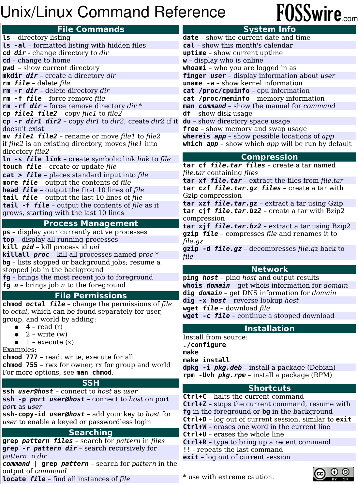

[:fontawesome-solid-house:](../index.md) :fontawesome-solid-angle-right: [HPCC](index.md) :fontawesome-solid-angle-right: **Intro to the Terminal**
# Intro to the Terminal

This page contains information of how to operate a linux/unix shell.
This was the main way people interacted with computers until the Windows came out in the 1990's.
Although most people interact with computers through a GUI (Graphical User Interface) nowdays, the only way we interact with the Super Computer (HPCC) is through the terminal.

## Broad Overview Tips

* For every linux command, you can type `man [bash command name]` and a vi page will pop up with the full information of that specific bash command. (To exit out of vi do ++colon+q+a+enter++ or ++shift+z+z++)
* It will take some time to get used to using these new commands and interacting with the computer in this exotic way. Everyone one of us were in your same shoes when we first started. You will get the hang of it soon!

## A Note on Terminology

Since we have now become linux users, we have to use the proper linux terminology. If you have been a mac user, this will be familiar. Throughout the guide and the rest of this website you will see these words favored but be reminded that the other synonyms are still ok to say.


|Linux Word (Appropriate) | Other Words that mean the same thing (Inappropriate) |
|---|---|
| directory | folder |
| path | address, file location |
| home directory (/home/eraider/) | For Windows: C:\Users\account_name ; For mac: Users/account_name |
| bash | shell scripting, programming language|
| linux | unix, shell, goated operating system |

## Basic Linux Commands

A good resource I would recommend reading to learn the most common commands and basic topics of shell scripting is this article: [colbly.edu terminal tutorial](https://cs.colby.edu/maxwell/courses/tutorials/terminal/). If you want more resources go to the [Extra Resources Heading](intro_to_terminal.md/#extra-resources-proceed-at-your-own-risk)

Below is a list of basic linux commands. There are many more and this is just the few that is necessary to learn when first getting started.

* `ls [path]` ls lists what is located in the directory path.
* `cd [path]` cd changes the directory to the path desired.
* `mkdir [folder name]` makes new directory with folder name as its name.
* `nano [filename]` opens the file in the nano text editor. Go to [Text Editors Heading](intro_to_terminal.md/#text-editors) for more info.
* `mv [source path] [destination path]` moves the file from the source path to the destination path. Similar to the ++ctrl+x++ or cut action.
* `cp [source path] [destination path]` copies the source file to the destination path. Similar to the ++ctrl+c++ or copy action.
* `pwd` prints the path of the current directory you are in.
* `grep ["text string"] [filepath]` prints out lines from the file that contains the "text string".

This picture contains probably every command you will ever need: [Source](https://files.fosswire.com/2007/08/fwunixref.pdf)



## Explanation of Path

The definition of the path is the specific location of where a specific file is in the human readable file storage system. We have always interacted with paths on Windows and Mac but using GUI Operating Systems hides the path of files by being able to click on folders and visually seeing files. In the Terminal, we have to be very cognicent of the path of where files are because we cannot drag and drop to manipulate files, we have to use commands. 


There are three main ways to write a path to a file or directory. In Linux, paths always and only contain forward slashes `/` and the slashes seperate directory levels (Looking at you Windows). Lets say we want to access a file named lost_file.help in a subdirectory of our homedirectory named lost_jungle. There is another subdirectory of our homedirectory named pretty ocean with cool_file.nice located inside of it. Below is a visual representation of the example filestructure.

```
home
|
└── the_eraider
    |
    ├── pretty_ocean
    |   |
    |   └── cool_file.nice
    |
    └──lost_jungle
        |
        └── lost_file.help
```

1. Full path: On the HPCC it would look something like this `/home/the_eraider/lost_jungle/lost_file.help`.

1. Relative path: Lets say we are another subdirectory of our home directory named pretty_ocean because we were reading cool_file.nice. We can get to the lost file like this `../lost_jungle/lost_file.help`. The `../` means to go to the directory above the pwd also called the parent directory. 

1. Tilde path: Where ever we are in the filesystem, we can you the tilde ++tilde++ and it is short hand for our home directory. To find the file we can do `~/lost_jungle/lost_file.help`.

There are some more path shorthands in the [Tips for Linux Heading](intro_to_terminal.md/#tips-for-linux)


## Text Editors

There are many different text editors to choose from to use.
The main difference between a text editor in the terminal and a text editor like Word is that in terminal, you barely use your mouse to determine where you cursor is on the document.
Another difference is that there is no undo/redo stack so be careful with what edits you do make and think about when to save a file.

Listed below are two favorites:

1. `nano [filename]` nano is the most simplest text editor to use because the commands for it are listed at the bottom of the screen. 
    * Here is a resource to learn the nano commands:
        * [unomaha.edu CSLC-Helpdocs-Nano.pdf](https://www.unomaha.edu/college-of-information-science-and-technology/computer-science-learning-center/_files/resources/CSLC-Helpdocs-Nano.pdf)
    * To exit out of nano without saving do ++ctrl+x+y+n++
1. `vi [filename]` vi is a very popular text editor and it has different modes. When you open vi you are in viewing mode and if you want to edit the file, you need to type ++i++ to enter it. 
    * Here are some resources to learn the vi commands: 
        * [colostate.edu vi webpage](https://www.cs.colostate.edu/helpdocs/vi.html)
        * [albany.edu vi_cheat_sheet.pdf](https://www.atmos.albany.edu/daes/atmclasses/atm350/vi_cheat_sheet.pdf)
    * To exit out of vi without saving do ++colon+q+a+enter++ or ++shift+z+z++
1. Here is a list of more text editors to try out if you don't like my suggestions: `emacs`, `less`, `vim`, `ne`, `ed`, `nvim`, `mcedit`, `tilde`, `micro`, `echo`, `sed`, `awk` and many more...


## Tips for Linux

Below contains a list of tips that I find helpful to know.

* Using the command `cd -` takes you to the last location you were at.
* When writing a path, you can press ++tab++ once to autocomplete a path or twice to list the possible autocomplete options.
* Star/Asterisk `*` means all. For example, `ls *` will list all of the sub directories and the pwd.
* Path Shorthand Tips:
    * Tilde ++tilde++ means your home directory.
    * Dot ++period++ means the directory you are currently in.
    * Dot-Dot-Slash `../` means the parent directory (directory above the one you are currently in).


## Extra Resources (Proceed at your own risk)

Below are links to documentation pages going into WAY more detail about bash.
Proceed at your own risk...

* A very detailed webpage about shell scripting is this: [apple developer docs](https://developer.apple.com/library/archive/documentation/OpenSource/Conceptual/ShellScripting/Introduction/Introduction.html#//apple_ref/doc/uid/TP40004268-TP40003516-SW1)
* A searchable list of every single linux command : [man7.org project](https://man7.org/linux/man-pages/index.html)
* Full blown bash documentation manuals [GNU Bash Reference Manual](https://www.gnu.org/software/bash/manual/bash.html) & [TLDP (The Linux Documentation Project)](https://tldp.org/LDP/Bash-Beginners-Guide/html/Bash-Beginners-Guide.html)