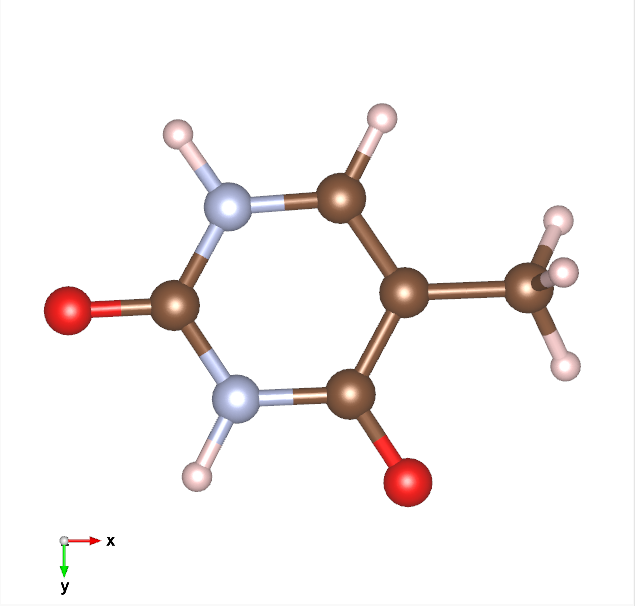

[:fontawesome-solid-house:](../index.md) :fontawesome-solid-angle-right: [Lessons](index.md) :fontawesome-solid-angle-right: **Lesson 1**
# Lesson 1

Written by Jeremy Schroeder

## How To Represent Molecular Structures


=== ":fontawesome-solid-house:"
    Lets say you have thymine. 
    There are 3 different ways to represent the molecule.
    In a 2d drawing, a singular thymine molecule in 3d space or a unitcell of repeating thymine molecules in 3d space. Click on the tabs to learn more.

=== "OChem Picture"
    If you are in OChem, this is the proper way to draw a molecule on paper.

    Any vertice without a letter is a carbon atom and Hydrogen atoms are omitted because organic chemists are lazy.

    Single, double and triple bonds are also denoted bu the amount of lines between two atoms.
    
    This method of drawing is called Line-bond (Skeletal) Formula.
    
    
    
    This [article](https://chem.libretexts.org/Bookshelves/Organic_Chemistry/Supplemental_Modules_(Organic_Chemistry)/Fundamentals/Structure_of_Organic_Molecules) has more detail on drawing organic molecules.
    
    Picture was generated using rdkit.

=== "OChem Picture With Hs"
    If you are in OChem and draw this picture, you will get laughed at.

    This picture makes more sense to draw for us, as Mechanical Engineers who do chemistry because we don't know where the Hydrogens are.

    This method of drawing is called Kekulé Formula.

    

    This [article](https://chem.libretexts.org/Bookshelves/Organic_Chemistry/Supplemental_Modules_(Organic_Chemistry)/Fundamentals/Structure_of_Organic_Molecules) has more detail on drawing organic molecules.
    
    Picture was generated using rdkit.

=== "3d Molecule"
    These are two screenshots of a single molecule of Thymine in 3d space.
    <div class="grid">
    
    
    </div>
    Pictures are from the program VESTA.

=== "3d Unitcell"
    These are three screenshots showing different planes of the unitcell containing thymine.
    
    The black box is the unitcell.

    Notice there are multiple thymine molecules and some are outside of the box (unitcell).

    
    <div class="grid">
    
    
    </div>
    
    
    Pictures are from the program VESTA.


## File Formats to Store Molecular Structures

=== ":fontawesome-solid-house:"

    This lists the different forms of file types you will encounter. Most DFT programs have their own specific (proprietary) input file format but it will most likely be similar to either a .xyz file or a .vasp file. Click on the tabs to learn more. 

=== ".smi file"

    This file format contains SMILE strings.
    
    A  simplified molecular-input line-entry system (SMILES) string is a machine readable piece of text that describes a 2d molecule and the bonds of that molecules.

    There are also other formats like SMARTS and InChI that are similar.
    ``` title="thymine.smi" linenums="1"
    O=C1NC(=O)NC=C1C
    ```

=== ".xyz file"
    This is an .xyz file. Programs such as Gaussian, Turbomole and Orca use this format.
    
    Line 1 contains an integer with the amount of atoms in the file.
    
    Line 2 is a comment line.
    
    Line 3->end contains Atom Species, X coordinate, Y coordinate, and Z coordinate in Angstroms (1 Å = 10^-10^m = 0.1 nm).

    ``` title="thymine.xyz" linenums="1"
    15
    Thymine
    O      0.746371    2.212376    0.013559
    C      0.054519    1.155212   -0.002823
    N     -1.306804    1.213724   -0.034984
    C     -2.051384    0.091465   -0.052607
    O     -3.319762    0.155793   -0.082577
    N     -1.404527   -1.088995   -0.037359
    C     -0.059461   -1.191232   -0.005583
    C      0.708818   -0.061006    0.012600
    C      2.188380   -0.118142    0.047555
    H     -1.779871    2.142669   -0.046138
    H     -2.007347   -1.956021   -0.051615
    H      0.437209   -2.147527    0.006130
    H      2.634177    0.819867    0.442722
    H      2.610813   -0.303296   -0.956171
    H      2.548868   -0.924887    0.747289

    ```
=== ".cif file"

    This is a .cif file.
    It contains unit cell and periodicity information.
    Material scientists create these files from XRD and spectroscopy experiments.
    There are typically no coordinates in this file but descriptions on the symmetry of the material.
    Each "loop_" line is the beginning or ending of a specific symmetry description.
    
    We get these files from crystallography databases such as [crystallography.net](https://www.crystallography.net/cod/), [CCDC](https://www.ccdc.cam.ac.uk/) and [Materials Project](https://next-gen.materialsproject.org/).

    ``` title="thymine.cif" linenums="1"
    #------------------------------------------------------------------------------
    #$Date: 2017-10-13 03:48:21 +0300 (Fri, 13 Oct 2017) $
    #$Revision: 201957 $
    #$URL: file:///home/coder/svn-repositories/cod/cif/2/01/58/2015856.cif $
    #------------------------------------------------------------------------------
    #
    # This file is available in the Crystallography Open Database (COD),
    # http://www.crystallography.net/. The original data for this entry
    # were provided by IUCr Journals, http://journals.iucr.org/.
    #
    # The file may be used within the scientific community so long as
    # proper attribution is given to the journal article from which the
    # data were obtained.
    #
    data_2015856
    loop_
    _publ_author_name
    'Borowiak, Teresa'
    'Dutkiewicz, Grzegorz'
    'Spycha\/la, Jaros\/law'
    _publ_section_title
    ;
    Supramolecular motifs in 1-(2-cyanoethyl)thymine and
    1-(3-cyanopropyl)thymine
    ;
    _journal_coeditor_code           GD3083
    _journal_issue                   3
    _journal_name_full               'Acta Crystallographica Section C'
    _journal_page_first              o201
    _journal_page_last               o203
    _journal_paper_doi               10.1107/S0108270107006385
    _journal_volume                  63
    _journal_year                    2007
    _chemical_formula_iupac          'C8 H9 N3 O2'
    _chemical_formula_moiety         'C8 H9 N3 O2'
    _chemical_formula_sum            'C8 H9 N3 O2'
    _chemical_formula_weight         179.18
    _chemical_name_common
    ;
    1-(2-cyanoethyl)thymine
    ;
    _chemical_name_systematic
    ;
    3-(5-methyl-2,4-dioxo-1,2,3,4-tetrahydropyrimidin-1-yl)propanenitrile
    ;
    _space_group_IT_number           14
    _space_group_name_Hall           '-P 2ybc'
    _symmetry_cell_setting           monoclinic
    _symmetry_space_group_name_Hall  '-P 2ybc'
    _symmetry_space_group_name_H-M   'P 1 21/c 1'
    _atom_sites_solution_hydrogens   geom
    _atom_sites_solution_primary     direct
    _atom_sites_solution_secondary   difmap
    _audit_creation_method           SHELXL97
    _cell_angle_alpha                90.00
    _cell_angle_beta                 98.253(3)
    _cell_angle_gamma                90.00
    _cell_formula_units_Z            4
    _cell_length_a                   11.2597(4)
    _cell_length_b                   4.4118(2)
    _cell_length_c                   17.6256(6)
    _cell_measurement_reflns_used    3997
    _cell_measurement_temperature    293(2)
    _cell_measurement_theta_max      29.62
    _cell_measurement_theta_min      2.33
    _cell_volume                     866.49(6)
    _computing_cell_refinement       'CrysAlis RED (Oxford Diffraction, 2006)'
    _computing_data_collection       'CrysAlis CCD (Oxford Diffraction, 2006)'
    _computing_data_reduction        'CrysAlis RED'
    _computing_molecular_graphics
    ;
    Stereochemical Workstation Operation Manual (Siemens, 1989) and MERCURY
    (Macrae <i>et al.</i>,  2006)
    ;
    _computing_publication_material  'Please provide missing details'
    _computing_structure_refinement  'SHELXL97 (Sheldrick, 1997)'
    _computing_structure_solution    'SHELXS97 (Sheldrick, 1997)'
    _diffrn_ambient_temperature      293(2)
    _diffrn_measured_fraction_theta_full 0.998
    _diffrn_measured_fraction_theta_max 0.898
    _diffrn_measurement_device_type  'Kuma KM4 CCD area-detector'
    _diffrn_measurement_method       \w
    _diffrn_radiation_monochromator  graphite
    _diffrn_radiation_source         'fine-focus sealed tube'
    _diffrn_radiation_type           MoK\a
    _diffrn_radiation_wavelength     0.71073
    _diffrn_reflns_av_R_equivalents  0.0183
    _diffrn_reflns_av_sigmaI/netI    0.0242
    _diffrn_reflns_limit_h_max       15
    _diffrn_reflns_limit_h_min       -15
    _diffrn_reflns_limit_k_max       5
    _diffrn_reflns_limit_k_min       -5
    _diffrn_reflns_limit_l_max       22
    _diffrn_reflns_limit_l_min       -23
    _diffrn_reflns_number            8802
    _diffrn_reflns_theta_full        25.00
    _diffrn_reflns_theta_max         29.61
    _diffrn_reflns_theta_min         2.34
    _diffrn_standards_decay_%        0
    _diffrn_standards_number         0
    _exptl_absorpt_coefficient_mu    0.102
    _exptl_absorpt_correction_T_max  0.980
    _exptl_absorpt_correction_T_min  0.837
    _exptl_absorpt_correction_type   multi-scan
    _exptl_absorpt_process_details   'CrysAlis RED (Oxford Diffraction 2006)'
    _exptl_crystal_colour            colourless
    _exptl_crystal_density_diffrn    1.374
    _exptl_crystal_density_method    'not measured'
    _exptl_crystal_description       block
    _exptl_crystal_F_000             376
    _exptl_crystal_size_max          0.45
    _exptl_crystal_size_mid          0.2
    _exptl_crystal_size_min          0.2
    _refine_diff_density_max         0.188
    _refine_diff_density_min         -0.202
    _refine_ls_extinction_method     none
    _refine_ls_goodness_of_fit_ref   1.036
    _refine_ls_hydrogen_treatment    refall
    _refine_ls_matrix_type           full
    _refine_ls_number_parameters     154
    _refine_ls_number_reflns         2187
    _refine_ls_number_restraints     0
    _refine_ls_restrained_S_all      1.036
    _refine_ls_R_factor_all          0.0589
    _refine_ls_R_factor_gt           0.0365
    _refine_ls_shift/su_max          0.000
    _refine_ls_shift/su_mean         0.000
    _refine_ls_structure_factor_coef Fsqd
    _refine_ls_weighting_details
    'calc w = 1/[\s^2^(Fo^2^)+(0.0659P)^2^+0.0478P] where P=(Fo^2^+2Fc^2^)/3'
    _refine_ls_weighting_scheme      calc
    _refine_ls_wR_factor_gt          0.0973
    _refine_ls_wR_factor_ref         0.1174
    _reflns_number_gt                1423
    _reflns_number_total             2187
    _reflns_threshold_expression     I>2\s(I)
    _cod_data_source_file            gd3083.cif
    _cod_data_source_block           I
    _cod_original_sg_symbol_H-M      'P 21/c'
    _cod_database_code               2015856
    _cod_database_fobs_code          2015856
    loop_
    _symmetry_equiv_pos_as_xyz
    'x, y, z'
    '-x, y+1/2, -z+1/2'
    '-x, -y, -z'
    'x, -y-1/2, z-1/2'
    loop_
    _atom_site_type_symbol
    _atom_site_label
    _atom_site_fract_x
    _atom_site_fract_y
    _atom_site_fract_z
    _atom_site_U_iso_or_equiv
    _atom_site_adp_type
    _atom_site_calc_flag
    _atom_site_occupancy
    N N1 0.69015(9) 0.4338(2) 0.16614(5) 0.0330(3) Uani d 1
    C C2 0.57613(10) 0.5355(3) 0.13772(7) 0.0328(3) Uani d 1
    O O2 0.48757(8) 0.4579(2) 0.16478(5) 0.0470(3) Uani d 1
    N N3 0.57166(9) 0.7327(3) 0.07725(6) 0.0355(3) Uani d 1
    H H3 0.4986(15) 0.804(3) 0.0571(8) 0.048(4) Uiso d 1
    C C4 0.66662(11) 0.8317(3) 0.04233(7) 0.0349(3) Uani d 1
    O O4 0.65004(8) 1.0135(2) -0.01110(5) 0.0503(3) Uani d 1
    C C5 0.78282(10) 0.7107(3) 0.07342(7) 0.0345(3) Uani d 1
    C C6 0.78883(11) 0.5213(3) 0.13305(7) 0.0341(3) Uani d 1
    C C11 0.70402(13) 0.2323(3) 0.23290(7) 0.0375(3) Uani d 1
    H H11A 0.7741(13) 0.116(3) 0.2274(8) 0.042(4) Uiso d 1
    H H11B 0.6311(13) 0.113(4) 0.2313(8) 0.044(4) Uiso d 1
    C C12 0.72076(13) 0.4038(4) 0.30899(8) 0.0416(3) Uani d 1
    H H12A 0.7238(13) 0.257(3) 0.3547(8) 0.053(4) Uiso d 1
    H H12B 0.6548(15) 0.530(4) 0.3159(9) 0.055(4) Uiso d 1
    C C13 0.83109(14) 0.5819(4) 0.31961(8) 0.0483(4) Uani d 1
    N N13 0.91629(13) 0.7239(4) 0.32592(8) 0.0734(5) Uani d 1
    C C51 0.88965(13) 0.8001(5) 0.03697(9) 0.0513(4) Uani d 1
    H H51A 0.8989(17) 1.027(5) 0.0298(12) 0.086(6) Uiso d 1
    H H51B 0.8827(15) 0.719(4) -0.0157(11) 0.071(5) Uiso d 1
    H H51C 0.9619(16) 0.713(4) 0.0613(10) 0.070(5) Uiso d 1
    H H6 0.8604(13) 0.430(3) 0.1547(8) 0.039(4) Uiso d 1
    loop_
    _atom_site_aniso_label
    _atom_site_aniso_U_11
    _atom_site_aniso_U_22
    _atom_site_aniso_U_33
    _atom_site_aniso_U_12
    _atom_site_aniso_U_13
    _atom_site_aniso_U_23
    N1 0.0316(5) 0.0355(6) 0.0317(5) 0.0039(4) 0.0033(4) 0.0017(4)
    C2 0.0300(6) 0.0359(7) 0.0325(6) 0.0004(5) 0.0046(5) -0.0016(5)
    O2 0.0339(5) 0.0557(6) 0.0534(6) 0.0004(4) 0.0129(4) 0.0100(5)
    N3 0.0261(5) 0.0456(7) 0.0341(6) 0.0046(4) 0.0018(4) 0.0051(5)
    C4 0.0316(6) 0.0435(8) 0.0291(6) 0.0011(5) 0.0027(5) 0.0019(5)
    O4 0.0372(5) 0.0688(7) 0.0443(6) 0.0050(4) 0.0033(4) 0.0213(5)
    C5 0.0279(6) 0.0453(8) 0.0305(6) 0.0024(5) 0.0045(5) -0.0017(5)
    C6 0.0279(6) 0.0408(7) 0.0330(6) 0.0059(5) 0.0024(5) -0.0020(5)
    C11 0.0412(7) 0.0340(7) 0.0367(7) 0.0031(6) 0.0041(6) 0.0051(5)
    C12 0.0444(8) 0.0461(8) 0.0342(7) 0.0010(6) 0.0052(6) 0.0030(6)
    C13 0.0531(9) 0.0515(9) 0.0362(7) -0.0002(7) -0.0071(6) 0.0060(6)
    N13 0.0664(9) 0.0809(11) 0.0661(10) -0.0210(8) -0.0135(7) 0.0097(8)
    C51 0.0337(7) 0.0759(13) 0.0463(9) 0.0046(7) 0.0127(6) 0.0107(8)
    loop_
    _atom_type_symbol
    _atom_type_description
    _atom_type_scat_dispersion_real
    _atom_type_scat_dispersion_imag
    _atom_type_scat_source
    C C 0.0033 0.0016 'International Tables Vol C Tables 4.2.6.8 and 6.1.1.4'
    H H 0.0000 0.0000 'International Tables Vol C Tables 4.2.6.8 and 6.1.1.4'
    N N 0.0061 0.0033 'International Tables Vol C Tables 4.2.6.8 and 6.1.1.4'
    O O 0.0106 0.0060 'International Tables Vol C Tables 4.2.6.8 and 6.1.1.4'
    loop_
    _geom_angle_atom_site_label_1
    _geom_angle_atom_site_label_2
    _geom_angle_atom_site_label_3
    _geom_angle
    C6 N1 C2 121.12(10)
    C6 N1 C11 120.60(10)
    C2 N1 C11 118.28(10)
    N1 C11 C12 112.95(11)
    N1 C11 H11A 103.8(9)
    C12 C11 H11A 110.8(8)
    N1 C11 H11B 108.2(8)
    C12 C11 H11B 106.9(8)
    H11A C11 H11B 114.2(13)
    C13 C12 C11 112.01(12)
    C13 C12 H12A 107.8(8)
    C11 C12 H12A 111.2(8)
    C13 C12 H12B 109.5(10)
    C11 C12 H12B 113.8(9)
    H12A C12 H12B 102.0(12)
    N13 C13 C12 178.12(15)
    O2 C2 N3 122.92(11)
    O2 C2 N1 122.51(12)
    N3 C2 N1 114.56(10)
    C2 N3 C4 127.13(10)
    C2 N3 H3 117.0(9)
    C4 N3 H3 115.8(9)
    O4 C4 N3 120.39(11)
    O4 C4 C5 124.07(11)
    N3 C4 C5 115.54(11)
    C6 C5 C4 118.01(11)
    C6 C5 C51 123.33(12)
    C4 C5 C51 118.65(12)
    C5 C51 H51A 114.6(11)
    C5 C51 H51B 110.3(10)
    H51A C51 H51B 103.6(16)
    C5 C51 H51C 112.9(10)
    H51A C51 H51C 111.2(16)
    H51B C51 H51C 103.1(14)
    C5 C6 N1 123.60(11)
    C5 C6 H6 122.4(8)
    N1 C6 H6 113.9(8)
    loop_
    _geom_bond_atom_site_label_1
    _geom_bond_atom_site_label_2
    _geom_bond_distance
    N1 C6 1.3820(16)
    N1 C2 1.3841(15)
    N1 C11 1.4652(15)
    C11 C12 1.5279(18)
    C11 H11A 0.958(15)
    C11 H11B 0.972(15)
    C12 C13 1.459(2)
    C12 H12A 1.030(15)
    C12 H12B 0.951(17)
    C13 N13 1.1378(19)
    C2 O2 1.2148(14)
    C2 N3 1.3709(16)
    N3 C4 1.3791(16)
    N3 H3 0.903(16)
    C4 O4 1.2306(15)
    C4 C5 1.4462(17)
    C5 C6 1.3365(18)
    C5 C51 1.4958(18)
    C51 H51A 1.02(2)
    C51 H51B 0.988(18)
    C51 H51C 0.945(17)
    C6 H6 0.933(14)
    loop_
    _geom_hbond_atom_site_label_D
    _geom_hbond_atom_site_label_H
    _geom_hbond_atom_site_label_A
    _geom_hbond_site_symmetry_A
    _geom_hbond_distance_DH
    _geom_hbond_distance_HA
    _geom_hbond_distance_DA
    _geom_hbond_angle_DHA
    N3 H3 O4 3_675 0.903(16) 1.929(17) 2.8301(14) 174.8(14)
    C11 H11B O2 2_645 0.972(15) 2.513(14) 3.2386(17) 131.4(10)
    C12 H12B O2 2_655 0.951(17) 2.530(18) 3.4645(18) 167.6(13)
    C6 H6 N13 2_745 0.933(14) 2.649(15) 3.5468(19) 161.7(11)
    loop_
    _geom_torsion_atom_site_label_1
    _geom_torsion_atom_site_label_2
    _geom_torsion_atom_site_label_3
    _geom_torsion_atom_site_label_4
    _geom_torsion
    C6 N1 C11 C12 92.05(14)
    C2 N1 C11 C12 -87.42(14)
    N1 C11 C12 C13 -63.62(15)
    C6 N1 C2 O2 178.61(11)
    C11 N1 C2 O2 -1.93(18)
    C6 N1 C2 N3 -2.00(17)
    C11 N1 C2 N3 177.47(10)
    O2 C2 N3 C4 -179.40(12)
    N1 C2 N3 C4 1.21(18)
    C2 N3 C4 O4 -178.96(11)
    C2 N3 C4 C5 0.37(19)
    O4 C4 C5 C6 178.10(12)
    N3 C4 C5 C6 -1.20(18)
    O4 C4 C5 C51 -2.6(2)
    N3 C4 C5 C51 178.13(13)
    C4 C5 C6 N1 0.44(19)
    C51 C5 C6 N1 -178.86(13)
    C2 N1 C6 C5 1.27(19)
    C11 N1 C6 C5 -178.19(12)
    loop_
    _cod_related_entry_id
    _cod_related_entry_database
    _cod_related_entry_code
    1 ChemSpider 8165403
    ```

=== ".vasp file"

    This is a .vasp or POSCAR file.
    It is a proprietary format for VASP but is also a good standard in the industry for unitcell cell containing structures.

    It contains unitcell information and the coordinates are positional/fractional coordinates.

    Line 1 is a comment line. (In older versions of VASP it contained system information)

    Line 2 contains a float of the lattice constant (a constant that is multiplied across the lattice matrix)

    Lines 3-5 contains the lattice matrix (a 3d vector to describe the unitcell).

    Line 6 contains species information.

    Line 7 contains the amount of each species.

    Line 8 contains information on coordinate units. Direct means positional/fractional coordinates and Cartesian means coordinate units are in angstroms.

    Lines 9->end contains a,b,c coordinates for each atom described in lines 6-7.
    ``` title="thymine.vasp" linenums="1"
    C8 H9 N3 O2
    1.0
        11.2596998215         0.0000000000         0.0000000000
         0.0000000000         4.4117999077         0.0000000000
        -2.5300564938         0.0000000000        17.4430679131
        N    C    O    H
    12   32    8   36
    Direct
        0.690150023         0.433800012         0.166140005
        0.309849977         0.566200018         0.833859980
        0.309849977         0.933799982         0.333859980
        0.690150023         0.066199988         0.666140020
        0.571659982         0.732699990         0.077249996
        0.428340018         0.267300010         0.922749996
        0.428340018         0.232699990         0.422749996
        0.571659982         0.767300010         0.577250004
        0.916289985         0.723900020         0.325919986
        0.083710015         0.276099980         0.674080014
        0.083710015         0.223900020         0.174080014
        0.916289985         0.776099980         0.825919986
        0.576129973         0.535499990         0.137720004
        0.423870027         0.464500010         0.862280011
        0.423870027         0.035499990         0.362280011
        0.576129973         0.964500010         0.637719989
        0.666620016         0.831700027         0.042330001
        0.333379984         0.168299973         0.957669973
        0.333379984         0.331700027         0.457670003
        0.666620016         0.668299973         0.542330027
        0.782819986         0.710699975         0.073420003
        0.217180014         0.289300025         0.926580012
        0.217180014         0.210699975         0.426580012
        0.782819986         0.789300025         0.573419988
        0.788829982         0.521300018         0.133049995
        0.211170018         0.478699982         0.866950035
        0.211170018         0.021300018         0.366950005
        0.788829982         0.978699982         0.633049965
        0.704020023         0.232299998         0.232899994
        0.295979977         0.767700016         0.767099977
        0.295979977         0.732299984         0.267100006
        0.704020023         0.267700016         0.732900023
        0.720759988         0.403800011         0.308990002
        0.279240012         0.596199989         0.691009998
        0.279240012         0.903800011         0.191009998
        0.720759988         0.096199989         0.808990002
        0.831089973         0.581900001         0.319610000
        0.168910027         0.418099999         0.680390000
        0.168910027         0.081900001         0.180390000
        0.831089973         0.918099999         0.819610000
        0.889649987         0.800100029         0.036970001
        0.110350013         0.199899971         0.963029981
        0.110350013         0.300100029         0.463030010
        0.889649987         0.699899971         0.536970019
        0.487569988         0.457899988         0.164780006
        0.512430012         0.542100012         0.835219979
        0.512430012         0.957899988         0.335219979
        0.487569988         0.042100012         0.664780021
        0.650039971         0.013499975         0.988900006
        0.349960029         0.986500025         0.011100000
        0.349960029         0.513499975         0.511099994
        0.650039971         0.486500025         0.488900006
        0.498600006         0.804000020         0.057100002
        0.501399994         0.195999980         0.942900002
        0.501399994         0.304000020         0.442900002
        0.498600006         0.695999980         0.557099998
        0.774100006         0.115999997         0.227400005
        0.225899994         0.884000003         0.772599995
        0.225899994         0.615999997         0.272599995
        0.774100006         0.384000003         0.727400005
        0.631099999         0.112999998         0.231299996
        0.368900001         0.887000024         0.768700004
        0.368900001         0.612999976         0.268700004
        0.631099999         0.386999995         0.731299996
        0.723800004         0.256999999         0.354699999
        0.276199996         0.743000031         0.645300031
        0.276199996         0.756999969         0.145300001
        0.723800004         0.243000001         0.854699969
        0.654799998         0.529999971         0.315899998
        0.345200002         0.470000029         0.684100032
        0.345200002         0.029999971         0.184100002
        0.654799998         0.970000029         0.815899968
        0.898899972         0.026999950         0.029800000
        0.101100028         0.973000050         0.970200002
        0.101100028         0.526999950         0.470200002
        0.898899972         0.473000050         0.529799998
        0.882700026         0.718999982         0.984300017
        0.117299974         0.281000018         0.015699999
        0.117299974         0.218999982         0.515699983
        0.882700026         0.781000018         0.484299988
        0.961899996         0.713000000         0.061299998
        0.038100004         0.287000000         0.938700020
        0.038100004         0.213000000         0.438699991
        0.961899996         0.787000000         0.561299980
        0.860400021         0.430000007         0.154699996
        0.139599979         0.569999993         0.845300019
        0.139599979         0.930000007         0.345300019
        0.860400021         0.069999993         0.654699981
    ```