[:fontawesome-solid-house:](../index.md) :fontawesome-solid-angle-right: [Lessons](index.md) :fontawesome-solid-angle-right: **Lesson 3**

# Lesson 3 - Using Molecular Mechanics (MM) to Learn About Geometry Optimization

Written by Jeremy Schroeder.

## Introduction

Geometry Optimizations are the backbone of DFT calculations. It is the first calculation you initiate with a new system or with new initial conditions. Below will describe in short detail how a geometry optimization happens using a force field method, [AMBER94](https://ttu-primo.hosted.exlibrisgroup.com/permalink/f/1j33bpi/TN_cdi_proquest_miscellaneous_15853065). This is a simplification of how DFT programs actually optimize structures but I believe it is a good start to understanding how DFT actually works. The below information is found in the github repository [tmpchem/computational_chemistry](https://github.com/tmpchem/computational_chemistry).

## Optimization Process Flow

=== ":fontawesome-solid-house:"

    Click through to look at the broad overview for how a molecular mechanics geometry opitimization works.

=== "Main Flow"

    ``` mermaid
    flowchart TD
    A[Initial Setup Step] ---> B[Main Step]
    B ---> C[Check for Convergence]
    C -- If Convergence \nCriteria is met --> D[Finish Calculation]
    C -- If Convergence \nCriteria is not met --> B

    ```

=== "Initial Setup Step"

    1. Finds Energy
    1. Finds Gradient
    1. Makes Initial Trajectory
    1. Sets initial convergence criteria values

=== "Main Step"

    1. Choses Step Direction
    1. Line Search (Moves Atoms) (two methods, conjugate gradient and steepest direction)
    1. Finds New Energy
    1. Finds New Gradient
    1. Edits Trajectory
    1. Updates convergence criteria values

## How to Find Energy

=== ":fontawesome-solid-house:"

    Click through to look at the equations to find the total energy of the system that is used every iteration step. These equations originate from the AMBER94 paper.

=== "Total Energy"

    $E_{total} = E_{potential} + E_{kinetic}$

    $E_{total} = (E_{bonded} + {E_{non\:bonded}} + E_{boundary}) + E_{kinetic}$

    $E_{total} = ((E_{bond} + E_{angle} + E_{torsion} + E_{out\:of\:plane}) + (E_{van\:der\:waals} + {E_{electrostatic}}) + E_{boundary}) + E_{kinetic}$

=== "Potential Energy"

    <h3>$E_{potential} = E_{bonded} + {E_{non\:bonded}} + E_{boundary}$</h3>

=== "Bonded Energy"

    For each bond, the energies below are calculated:
        
    * If not noted, the argument is a float value.

    <h3>$E_{bond} = k_b * (r_{ij} - r_{eq})^2$</h3>
        
    Energy [kcal/mol] of bond ij.
        
    * $r_{ij}$ - Distance [Angstrom] between atoms i and j.
    * $r_{eq}$ - Equilibrium bond length [Angstrom] of bond ij.
    * $k_b$ - Spring constant [kcal/(mol*A^2)] of bond ij.
    
    <h3>$E_{angle} = k_a * ( \frac{\pi}{180} * (a_{ijk} - a_{eq}) )^2$</h3>
    
    Energy [kcal/mol] of angle ijk.

    * $a_{ijk}$ - Angle [degrees] between atoms i, j, and k.
    * $a_{eq}$ - Equilibrium bond angle [degrees] of angle ijk.
    * $k_a$ - Spring constant [kcal/(mol*rad^2)] of angle ijk.

    <h3>$E_{torsion} = v_n * \frac{1.0 + cos(\frac{\pi}{180} * (nfold*t_{ijkl} - \gamma))}{paths}$</h3>

    Energy [kcal/mol] of torsion ijkl.

    * $t_{ijkl}$ - Torsion [degrees] between atoms i, j, k, and l.
    * $v_n$ - Half-barrier height [kcal/mol] of torsion ijkl.
    * $\gamma$ - Barrier offset [degrees] of torsion ijkl.
    * $nfold$ - (int) Barrier frequency of torsion ijkl.
    * $paths$ - (int) Number of distinct paths in torsion ijkl.

    <h3>$E_{out\:of\:plane} = v_n * (1.0 + cos(\frac{\pi}{180} * (2.0 * o_{ijkl} - 180)))$</h3>

    Energy [kcal/mol] of outofplane ijkl.

    * $o_{ijkl}$ - Outofplane angle [degrees] between atoms i, j, k, and l.
    * $v_n$ - Half-barrier height [kcal/mol] of torsion ijkl.    

=== "Non Bonded Energy"
    
    For every atom pair, the energies below are calculated

    <h3>$E_{van\:der\:waals} = \epsilon_{ij} * ( r_{6ij}^2 - 2.0 * r_{6ij} )$</h3>
    
    Where $r_{6ij} = (r_{oij} / r_{ij})^6$
    
    Van der waals energy [kcal/mol] between pair ij.

    * $r_{ij}$ - Distance [Angstrom] between atoms i and j.
    * $\epsilon_{ij}$ - Van der Waals epsilon [kcal/mol] between pair ij.
    * $r_{oij}$ - Van der Waals radius [Angstrom] between pair ij.

    <h3>$E_{electrostatic} = \frac{332.06375 * q_i * q_j } {\epsilon * r_{ij}}$</h3>

    Electrostatic energy [kcal/mol] between pair ij.
    
    * $r_{ij}$ - Distance [Angstrom] between atoms i and j.
    * $q_i$ - Partial charge [e] of atom i.
    * $q_j$ - Partial charge [e] of atom j.
    * $\epsilon$ - Dielectric constant of space (>= 1.0).
    * 332.06375 is the conversion of electrostatic energy from [ceu] to [kcal/mol]. 

=== "Boundary energy"

    Calculate simulation boundary energy of an atom.

    <h3>$E_{boundary\:cubic} = k_{box} * (|n_{atom} - n_{origin}| - bound)^2$ where $n = x,y,z$</h3>

    For all atoms outside the boundary box,

    * $k_{box}$ - Spring constant [kcal/(mol*A^2)] of boundary.
    * $bound$ - Distance from origin [Angstrom] of boundary. Aka how large the boundary is.
    * $atom\:coords$ - Array of cartesian coordinates [Angstrom] of atom.
    * $origin\:coords$ - Array of cartesian coordiantes [Angstrom] of origin of simulation.

    <h3>$E_{boundary\:spherical} = k_{box} * (r_{io} - bound)**2$</h3>
    
    For all atoms outside the boudary sphere,
    
    * $r_{io}$ - 3d distance between origin and atom.
        * $r_{io} = \sqrt{(x_{atom} - x_{origin})^2 + (y_{atom} - y_{origin})^2 + (z_{atom} - z_{origin})^2}$
    * $k_{box}$ - Spring constant [kcal/(mol*A^2)] of boundary.
    * $bound$ - Distance from origin [Angstrom] of boundary. Aka how large the boundary is.

=== "Kinetic Energy"

    For every atom,

    <h3>$E_{kinetic} = mass_{atom} * n_{velocity}^2$ where $n = x,y,z$</h3>
    
    * $mass_{atom}$ - Mass [g/mol] of atom.
    * velocity - Array of velocities [Angstrom/ps] of atom.
        * Either you use the velocities of step n (default method) or an average of step n and step n-1 (leapfrog method).
    

=== "Equations in python code"

    Below are links to each equation in a python codebase.

    * Bonded Energy Consists of:
        * Bond Energy [Source](https://github.com/tmpchem/computational_chemistry/blob/master/scripts/molecular_mechanics/mmlib/energy.py#L15)
        * Angle Energy [Source](https://github.com/tmpchem/computational_chemistry/blob/master/scripts/molecular_mechanics/mmlib/energy.py#L29)
        * Torsion Energy [Source](https://github.com/tmpchem/computational_chemistry/blob/master/scripts/molecular_mechanics/mmlib/energy.py#L43)
        * Out of Plane Energy [Source](https://github.com/tmpchem/computational_chemistry/blob/master/scripts/molecular_mechanics/mmlib/energy.py#L59)
    * Non Bonded Energy Consists of:
        * Van der Waals Energy [Source](https://github.com/tmpchem/computational_chemistry/blob/master/scripts/molecular_mechanics/mmlib/energy.py#L72)
        * Electrostatic Energy [Source](https://github.com/tmpchem/computational_chemistry/blob/master/scripts/molecular_mechanics/mmlib/energy.py#L87)
    * Potential Energy consists of:
        * Bonded Energy
        * Non Bonded Energy
        * Bound Energy [Source](https://github.com/tmpchem/computational_chemistry/blob/master/scripts/molecular_mechanics/mmlib/energy.py#L102)
    * Total Energy consists of:
        * Potential & Kinetic Energy [Source](https://github.com/tmpchem/computational_chemistry/blob/master/scripts/molecular_mechanics/mmlib/energy.py#L277)


## How to Find the Gradient and Convergence

=== ":fontawesome-solid-house:"

    Click through to look at the details of how the gradient is created and how a calculation finishes by convergence.

=== "Perturbation"

    Each atom is perturbed and moved in each axis direction (6 times) and the energy of the system is recorded for each pertubation.

    This in turn is calculating the Energy gradient or the first derivative of it.

    The picture below shows a potential energy surface for a water molecule with x axis being the H-O-H bond angle, y axis being 1 O-H bond length and z axis being the total energy of that particular structure. [^1]

    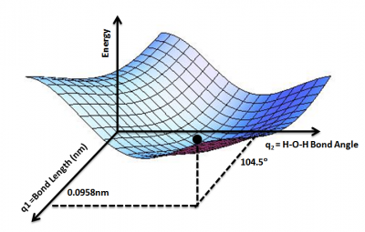

=== "Finding the lowest energy"

    There are different techniques to do a search method on a 3d matrix such as conjugate gradient and steepest descent/direction. We want to choose the perturbed structure that produces the lowest energy is a global minima not just a local minima. [^2]

    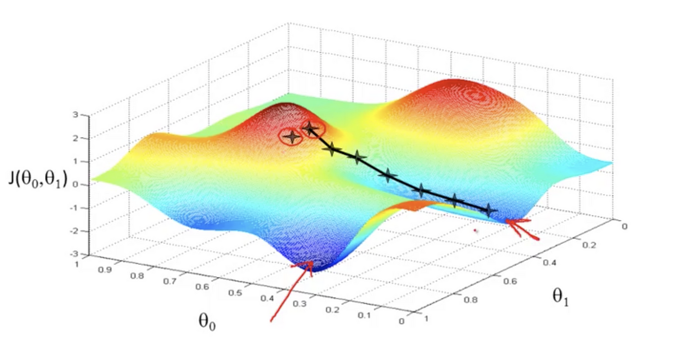

=== "Convergence"

    After multiple optimization steps, if you compare the change in total energy and the displacement of each atom among other values. If the change is less than $10^-6$ (standard value) then the calculation is converged and it will stop.[^3]

    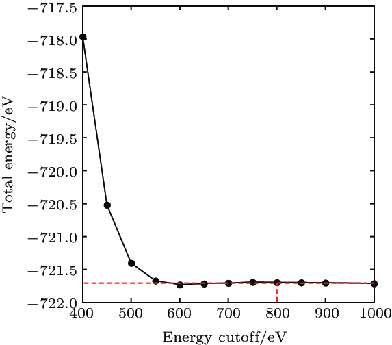
    
## Example Optimization

=== ":fontawesome-solid-house:"

    Lets look at an example optimization. The first geometry is a linear (bond angle 180°) H2O molecule with a bond length of 1.5 Å. The second geometery is a bent (bond angle 90°) H2O molecule with a bond length of 1.5 Å. The following slides will show how Turbomole optimized each of these geometries.

=== "Initial Guess Geometries"

    <div class="grid">
    
    Geometry 1
    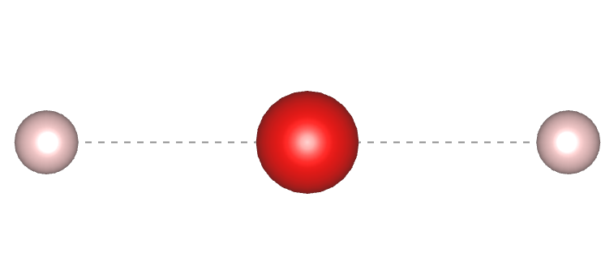

    Geometry 2
    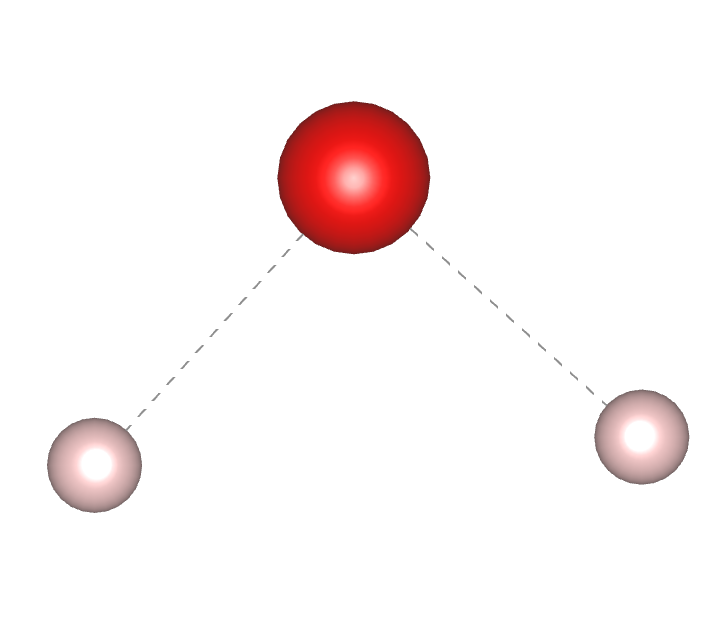
    
    </div>

    Pictures were obtained from VESTA.

=== "Bond Angle vs. H-O Distance"

    <div class="grid">
    
    Geometry 1
    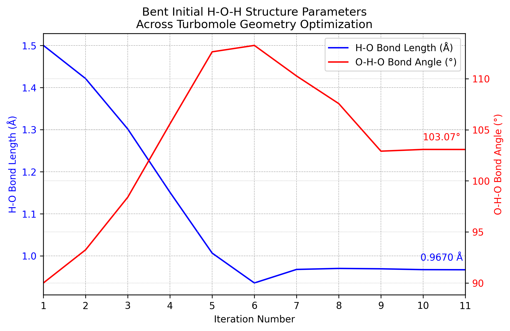

    Geometry 2
    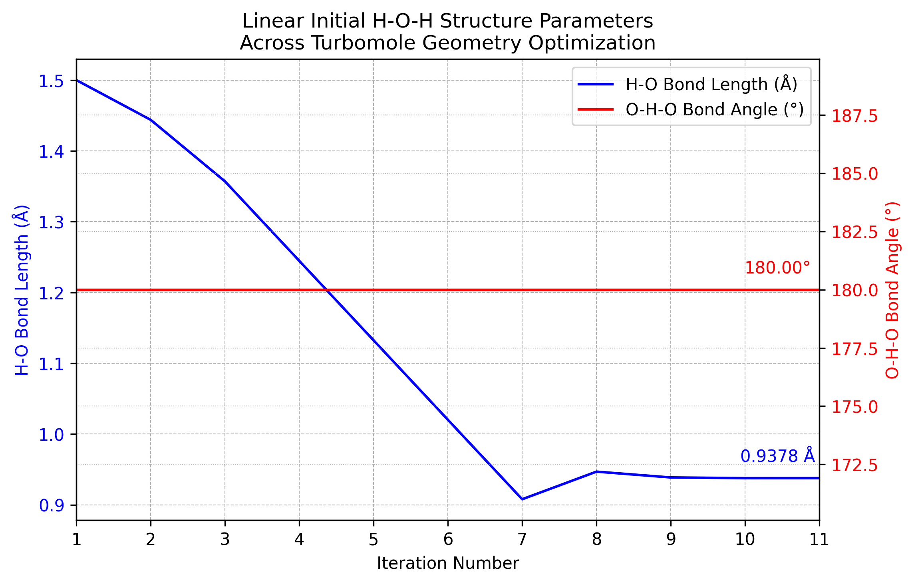
    
    </div>

=== "Energy Amount Across Optimization"
   
    <div class="grid">
    
    Geometry 1
    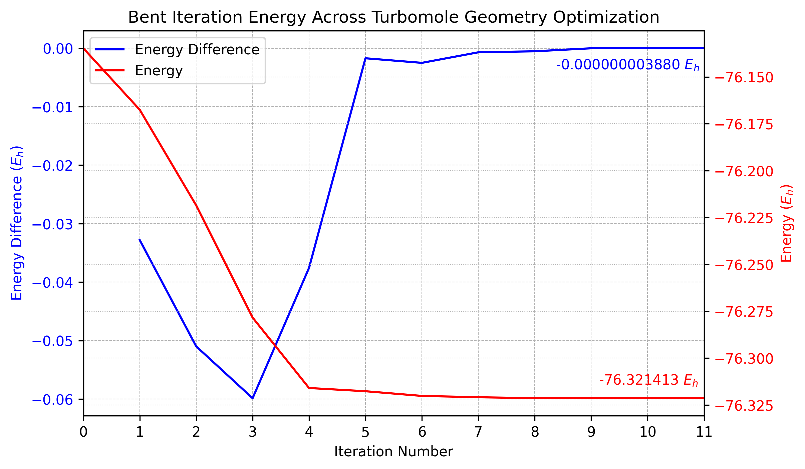

    Geometry 2
    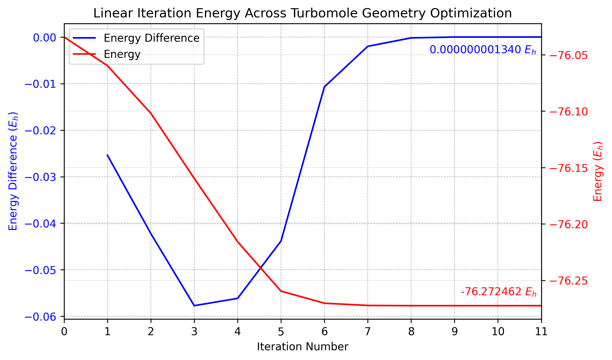
    
    </div>

=== "Optimized Geometries and Final Energies"

    <div class="grid">
    
    Geometry 1:  $-76.27246207551\:E_h$
    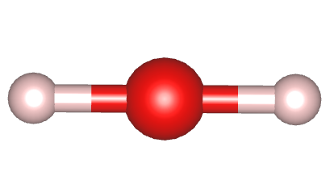

    Geometry 2:  $-76.32141258581\:E_h$
    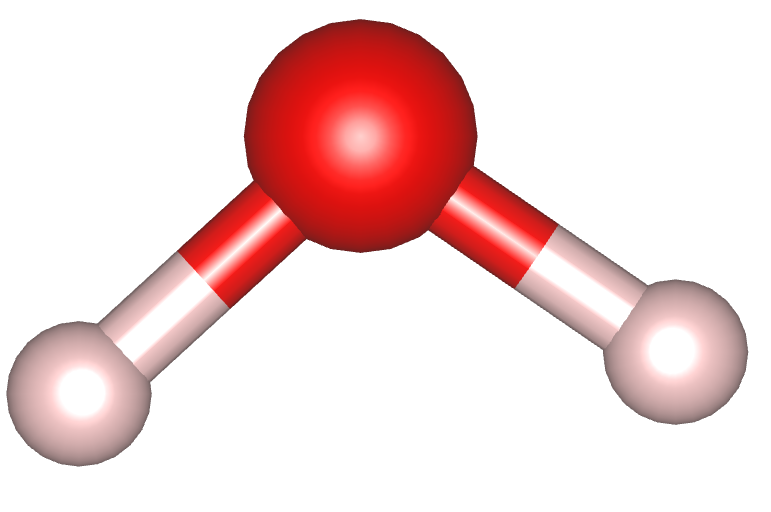
    
    </div>

    Pictures were obtained from VESTA.

## Recap

A geometry optimization is an iterative process that takes an initial structure, then calculates the total energy of the structure and the energy gradient and iterates on the structure until the total energy converges to a stable value. For DFT calculations, the energy calculation step is more complicated but the main idea of finding a gradient and the structure changing is the same. Check out [Assignment 2](assignment_2.md) if you are interested in understanding more about an optimization and creating a Potential Energy Surface (PES).


[^1]: https://en.wikipedia.org/wiki/Potential_energy_surface

[^2]: https://www.scribd.com/document/441758196/Gradient-Descent

[^3]: Wang, X.-Y & Zhao, F.-P & Wang, Jie & Yan, Yabin. (2016). First-principle studies of mechanical, electronic properties and strain engineering of metal-organic framework. Acta Physica Sinica. 65. 10.7498/aps.65.178105. 