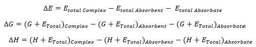

[:fontawesome-solid-house:](../index.md) :fontawesome-solid-angle-right: [Lessons](index.md) :fontawesome-solid-angle-right: **Lesson 7**

# Lesson 7 - What is an adsorption reaction?

Written by Jeremy Schroeder

## Introduction

An adsorption reaction is a chemical reaction that happens on the surface of a material. This reaction is characterized by the absorbate (a molecule in the environment) being attracted to the absorbent (the surface) and adsorbing to the surface (potentially bonding but being attracted and having van der waals interactions between the surface and the absorbent).

## How to Model an Adsorption Reaction

To model an adsorption reaction we need three initial geometries:

* Absorbate (Slab) - The surface we are wanting to model.
* Absorbent (Molecule) - The molecule we are wanting to study the interaction with the surface.
* Complex - It is created when you take the slab and add the absorbent on top of the surface.

The results we want from the adsorption reaction are ΔE, ΔH and ΔG. We get these results from Turbomole using the formulas below:



## How to make the Complex

To make the complex we are going to utilize the python library [molecule_lib](https://jerschro.github.io/molecule_lib_documentation/). To download this library into your local base conda installation, run the script below on the HPCC:

``` bash
bash /home/jerschro/Scripts/molecule_lib/install.sh

```

The path to files we will use to make our complexes are here:

``` bash
cd /home/jerschro/UG/structures

```

Below is code you can use to combine an absorbent.xyz file and a slab.xyz file to create a complex. Check out the link for more information [Link](https://jerschro.github.io/molecule_lib_documentation/user_guides/complexes/).

``` python
from molecule_lib import *

absorbent = read_xyz("absorbent.xyz")
slab = read_xyz("slab.xyz")

mol_complex = slab.add_coords(molecule=absorbent,
                              axis="z", 
                              absorbent_reference="Bottom",
                              surface_reference="Top",
                              dist=2.0)
mol_complex.to_xyz("complex.xyz")

```

