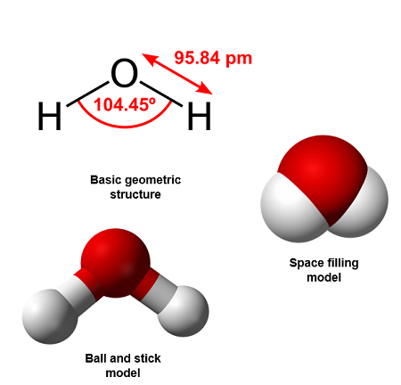
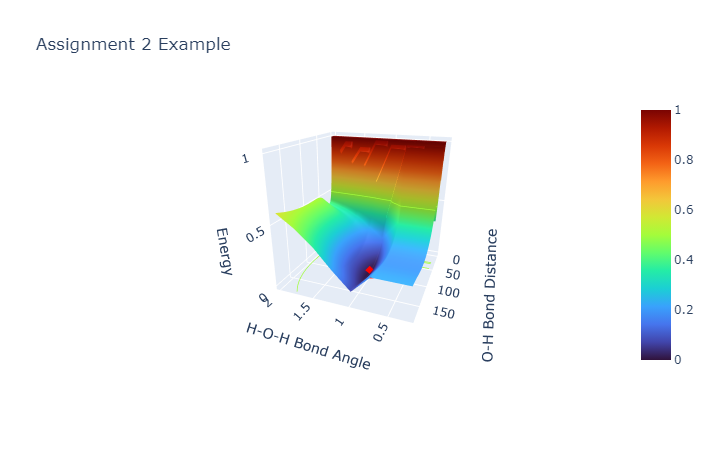

[:fontawesome-solid-house:](../index.md) :fontawesome-solid-angle-right: [ME 4331](index.md) :fontawesome-solid-angle-right: **Assignment 2**

# Assignment 2 - Create a Potential Energy Surface (PES)

This is an optional assignment but a good learning tool and programming project if you want to learn. Written by Jeremy Schroeder.

## Description 

I want you to create a potential energy surface for a H2O molecule. Below is a picture of what the lowest energy structure is for H2O. I want you to explore all possible structures of H2O to determine if this is truly the case.

Looking at the water molecule, there are 3 independent geometry variables that can change in the structure: 

1. The bond angle of H-O-H bond.
1. The bond distance of H1-O.
1. The bond distance of H2-O.

So to create an energy surface, we can keep one variable constant and change the other two. For example, we can change the bond distances H1-O and H2-O bond for a specific bond angle. For simplification of this assignment and ability to visualize a PES in 3d space, lets fix the bond distances to be equal to eachother. Therefore the two indepenendent variables for the PES are Bond Angle H-O-H and Bond Distance of both O-H bonds.

The ranges of each variable should be:

* Bond angle - between 0-180°
* Bond distances - betwen 0.25-2 Å

You can use a DFT program such as Turbomole, Gaussian 16 and Orca or you can use a lesser computationally expensive level of theory like [XTB](https://xtb-python.readthedocs.io/en/latest/) or [MM](https://github.com/tmpchem/computational_chemistry) as a calculator to calculate the single point energies.

## Tasks

1. Create a workflow using python or bash to strategically create structures, send the structures to the energy calculator and record the total energy value found from the calculator.
1. Determine a simplified method to store the large amount of data retreived from the script.
1. Use a graphical software like pyplot to graphically show the results and the PES.
1. Identify the global minimum and local minima found.

## Example

Below is a picture of an example PES that was generated for this project.

## Hints

If you need help, feel free to contact Jeremy. You should try to use XTB to save on computational resources and run it locally.
