[:fontawesome-solid-house:](../index.md) :fontawesome-solid-angle-right: [ME 4331](index.md) :fontawesome-solid-angle-right: **Lesson 9**
# Lesson 9 - Intro To Quantum Mechanics

Written by Jeremy Schroeder.

## Introduction

All levels of theory (DFT, HF etc.) are simplifications and special cases of Quantum Mechanics. So in this lesson, we will do a deep dive in quantum mechanics to understand where the equations that define DFT come from. 

## Time Independent Schrödinger Equation

This is the equation that defines all particle interactions for DFT. There is a time dependent Schrödinger Equation but that is more complicated and we don't use it in DFT but it is used in AIMD (Ab-Initio Molecular Dynamics) where time is considered.

Hamiltonionian Case:

$\hat{H} \psi = E \psi$

1-D Case:

$-\frac{\hbar^2}{2m} \frac{d^2 \psi(x)}{dx^2} + V(x) \psi(x) = E \psi(x)$

where $\psi(x) = (\frac{2}{l})^{1/2} \sin(\frac{n\pi x}{l})$

## Particle in a One-Dimensional Infinite Well

This is the first analytical solution to the Schrödinger equation. Lets say we have a 1-D Box where the potential well is infinty from x < 0 and x > l. 

In Region I and Region III, 

* $\psi_I(x) = \psi_{III}(x) = 0$. 
* $V_I(x) = V_{III}(x) = \infty$

In Region II,

* $\psi_{II}(x) = (\frac{2}{l})^{1/2} \sin(\frac{n\pi x}{l})$
* $V_{II}(x) = 0$
* $n = 1,2,3,4,5...$

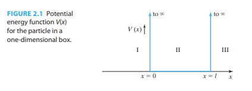

If you notice there is n in the wavefunction equation. n is the principle quantum number and is any non zero positive integer. This process of assigning n is quantization. This is where quantum comes from in quantum mechanics. The below image is showing the wave function for n = 1,2,3. 

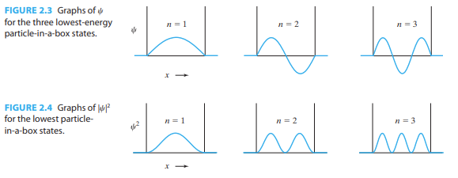

$\psi$ is the location of where a particle and $|{\psi}^2|$ is the probability density of where that particle will be found. For the 1-D Box, $\int_{0}^{l} |{\psi(x)}^2| dx = 1$.

## Particle in a One-Dimensional Rectangular Well

If the Potential function is not infinite, then we have:

* $V_I(x) = V_{III}(x) = V_0$
* $V_{II}(x) = 0$
* $\psi_I(x) = C \exp[(\frac{2m}{\hbar^2})^{1/2}(V_0 - E)^{1/2}x]$
* $\psi_{II}(x) = A \cos((\frac{2m}{\hbar^2})^{1/2}E^{1/2}x) + B \sin((\frac{2m}{\hbar^2})^{1/2}E^{1/2}x)$
* $\psi_{III}(x) = G \exp[-(\frac{2m}{\hbar^2})^{1/2}(V_0 - E)^{1/2}x]$

If $\psi \rightarrow 0$ as $x \rightarrow -\infty$ and $x \rightarrow \infty$, this is a bound state. For a bound state, you are guranteed to find the particle in a finite region. For an unbound state which is where $\psi$ does not go to zero as $x \rightarrow -\infty$ and $x \rightarrow \infty$. For this case, if $E > V_0$ it is unbound and if $E < V_0$ is a bound state.

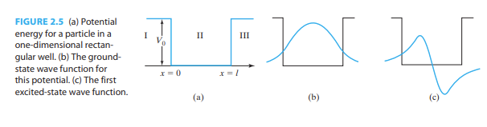

If you notice in the picture above, in image (b), the probability density of the wave function exists in Region I and Region II which is different than in the infinite well case. This is the theory behind quantum tunnelling of particles. This picture is a bound state so $E < V_0$, in classical theory, a particle would not be able to exist being the potential well but here in quantum mechanics, there is a chance the particle will escape the potential well.

## A Note on Operators

## Angular Momentum of a Particle

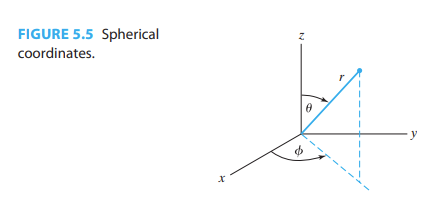

Below are Angular Momentum Equations for a particle in 3D coordinates. Notice they are operators and that $\hat{L_z}$ is a much simplier equation than $\hat{L_x}$ and $\hat{L_y}$.

* $\hat{L_x} = i\hbar(\sin\phi\frac{\delta}{\delta\theta} + \cot\theta\cos\phi\frac{\delta}{\delta\phi})$
* $\hat{L_y} = -i\hbar(\cos\phi\frac{\delta}{\delta\theta} - \cot\theta\sin\phi\frac{\delta}{\delta\phi})$
* $\hat{L_z} = -i\hbar\frac{\delta}{\delta\phi}$
* $\hat{L}^{2} = -i\hbar^{2}(\frac{\delta^2}{\delta\theta^2} + \cot\theta\frac{\delta}{\delta\theta} + \frac{1}{\sin^2\theta}\frac{\delta^2}{\delta\phi^2})$

Because $[\hat{L_z}, \hat{L}^2] = 0$, operators $\hat{L_z}$ and $\hat{L}^2$ commute. Therefore we can write the equations below:

* $\hat{L_z}Y(\theta,\phi) = m\hbar Y(\theta,\phi)$
* $\hat{L}^2Y(\theta,\phi) = l(l+1)\hbar^2Y(\theta,\phi)$

Where $Y(\theta,\phi)$ is an arbitrary eigenfunction and $m\hbar$ and $l(l+1)\hbar^2$ are eigenvalues of $\hat{L_z}$ and $\hat{L}^2$ respectively.

Then we find the eigenfunction for the above set of equations:

* $Y_{l}^{m}(\theta, \phi) = \frac{1}{\sqrt{2\pi}} S_{l,m}(\theta)e^{im\phi}$

Where $m$, and $l$ are other quantum numbers.

* $l = 0, 1, 2,...$
* $m = -l, -l+1,...-1,0,1,...+l-1,+l$

$S_{l,m}(\theta)$ is given by the equations below. This is called a Legrende Equation by the person who discovered it.

* $S_{l,m}(\theta) = \sin^{|m|}\theta\sum_{\substack{j=1,3,...\\or\:j=0,2...}}^{l-|m|}a_j\cos^j\theta$
* $a_{j+2} = \frac{(j+|m|)(j+|m|+1)-l(l+1)}{(j+1)(j+2)}$

This table shows the above series expansion for different l and m quantum numbers.

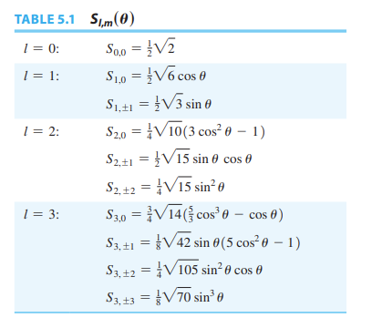

## Describing the Hydrogen Atom

Now we have a set of eigenfunctions to describe the one central atom problem.

* $\hat{H}\psi = E\psi$
* $\hat{L}^2\psi = l(l+1)\hbar^2\psi$ where $l = 0, 1, 2,...$
* $\hat{L_z}\psi = m\hbar \psi$ where $m = -l, -l+1,...-1,0,1,...+l-1,+l$

Where $\psi = R(r)Y_{l}^{m}(\theta, \phi)$

There is a lot more math and derivation to get to orbital functions. Below is what orbital the quantum number l denotes.

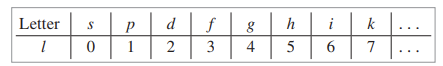

The solution of $R(r)$ for the bond state of the Hydrogenlike atom is below:

* $R_{nl}(r) = r^le^{-\frac{Zr}{na}}\sum_{j=0}^{n-l-1}b_jr^j$

Where $a = \frac{4\pi\epsilon_0\hbar^2}{\mu e^2}$ and Z is atomic number (Z = 1 for Hydrogen).

So the complete wavefunction for a Hydrogenlike atom is:

* $\psi_{nlm}(r, \theta, \phi) = R_{nl}(r)Y_l^m(\theta, \phi)$
* $\psi_{nlm}(r, \theta, \phi) = R_{nl}(r)S_{l,m}(\theta)\frac{1}{\sqrt{2\pi}}e^{im\phi}$
* $\psi_{nlm}(r, \theta, \phi) = r^le^{-\frac{Zr}{na}}\sum_{j=0}^{n-l-1}[b_jr^j] * \sin^{|m|}\theta\sum_{\substack{j=1,3,...\\or\:j=0,2...}}^{l-|m|}[a_j\cos^j\theta] * \frac{1}{\sqrt{2\pi}}e^{im\phi}$

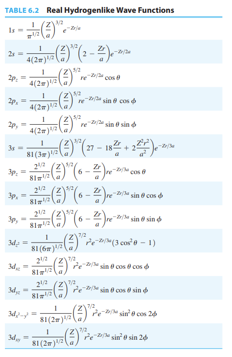

The constant a stated earlier is actually the Bohr radius, which is the radius of the circle in which the electron moved in the grpund state of the hydrogen atom in Bohr Theory.

* $a = \frac{4\pi\epsilon_0\hbar^2}{\mu e^2}$
* $\mu = \frac{m_em_p}{m_e + m_p}$

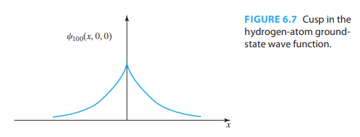

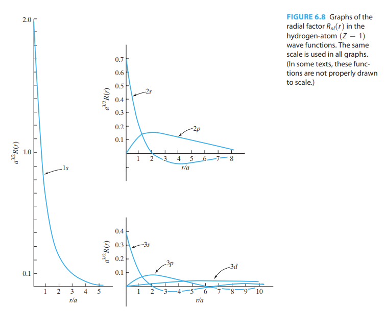

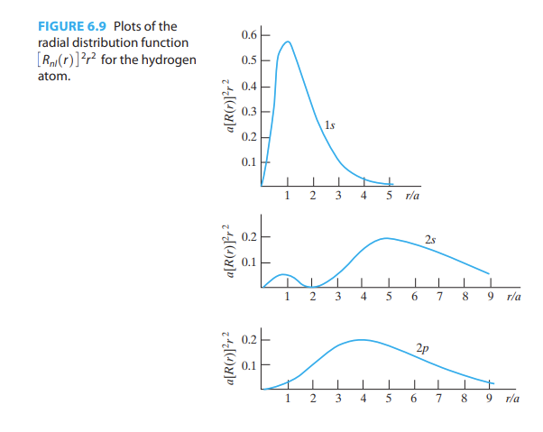

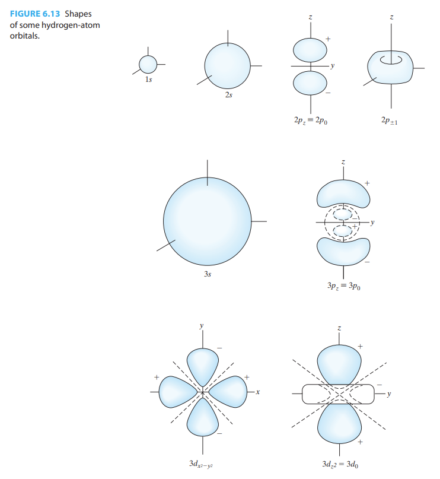

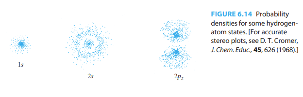

## Work Still Needed

* Add Quantum Chemical Theorems and Assumptions
* Table 15.1
* Chapter 15.17 Solvent Effects

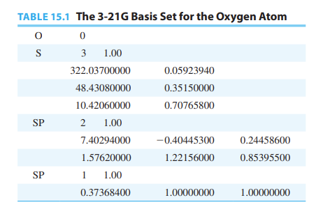

## Citations

* All Figures and Images are from I. Levine, Quantum Chemistry, 7th Edition, Pearson