[:fontawesome-solid-house:](../index.md) :fontawesome-solid-angle-right: [ME 4331](index.md) :fontawesome-solid-angle-right: **Resource 1**

# Intro to DFT PPT
This powerpoint was made by Jerimiah Zamora and Tristan Fisher. You can click on the first picture and pull up a full screen slideshow.

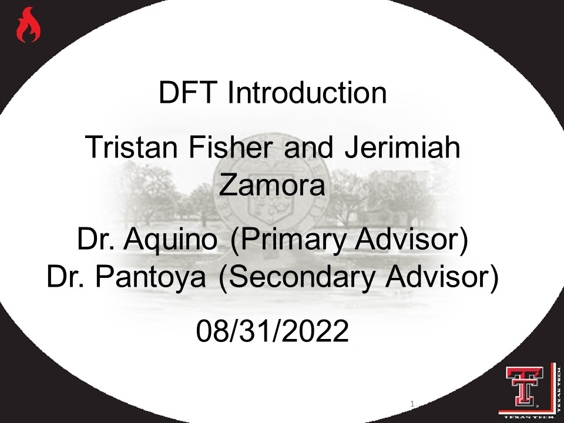

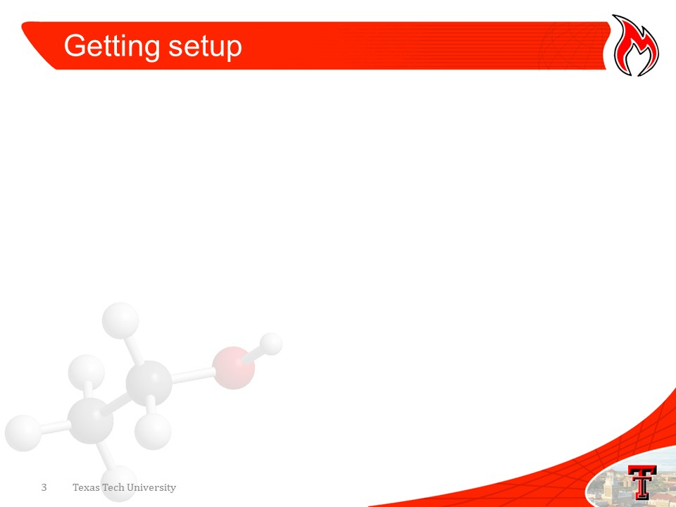
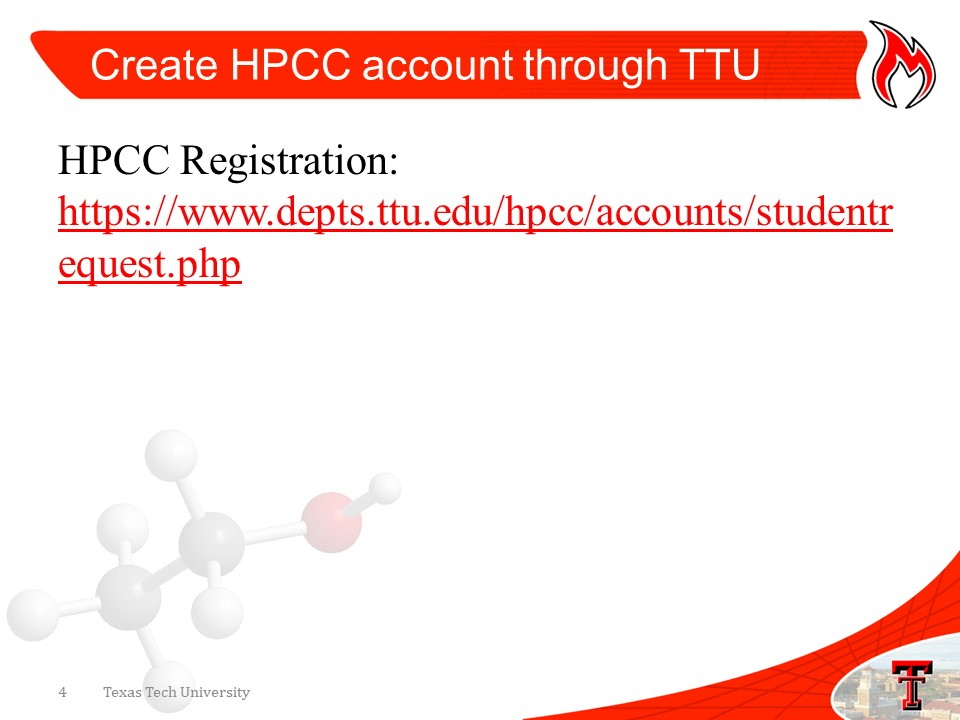
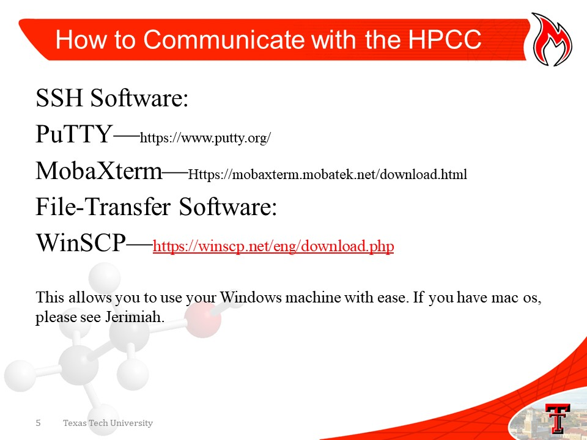

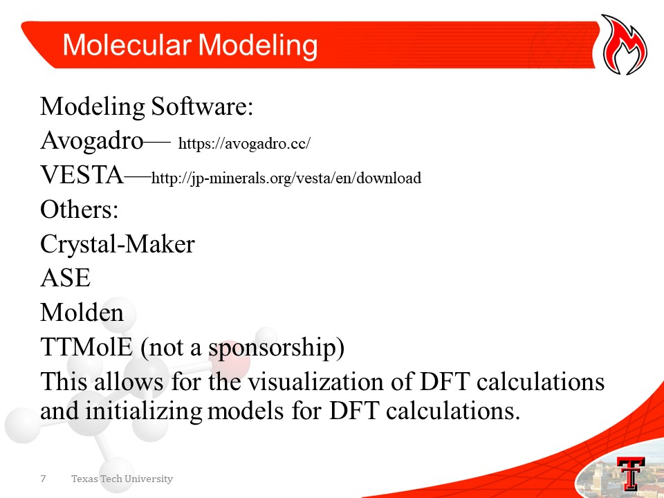
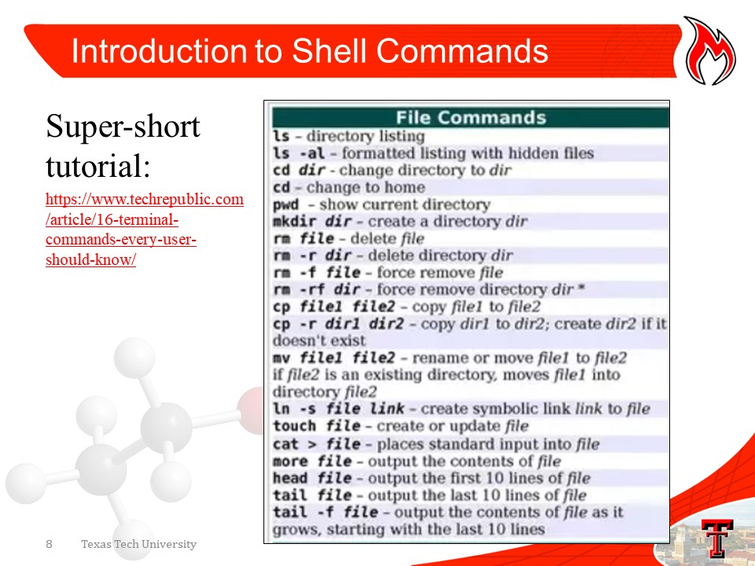
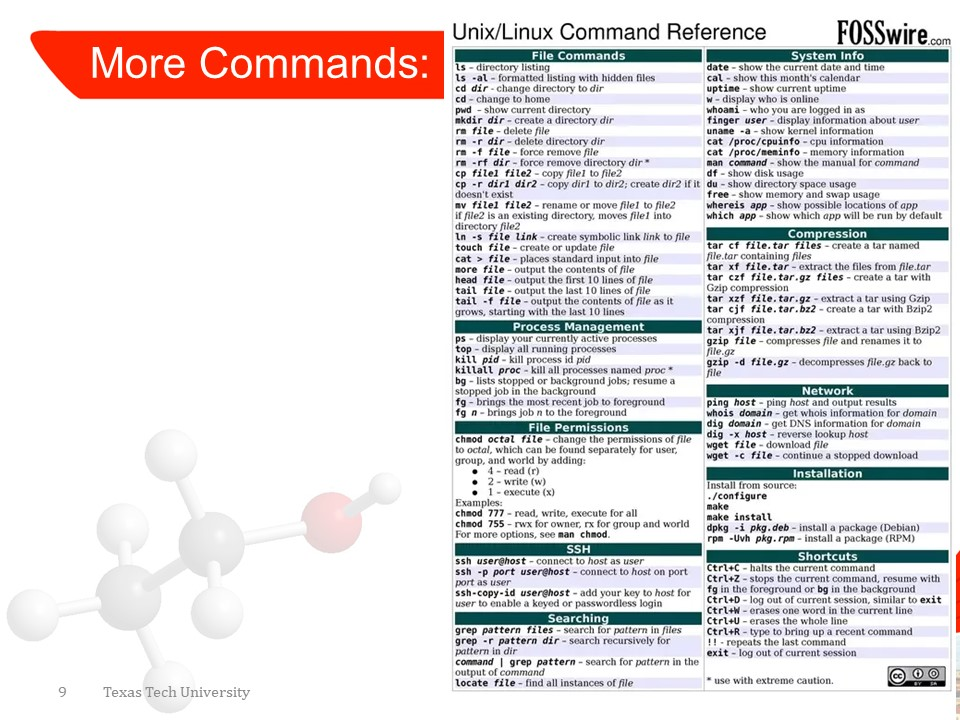
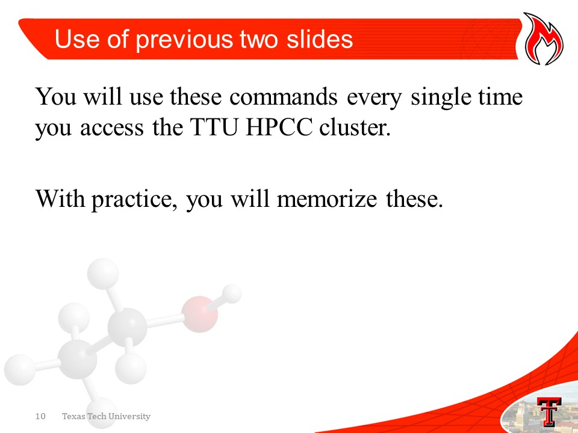
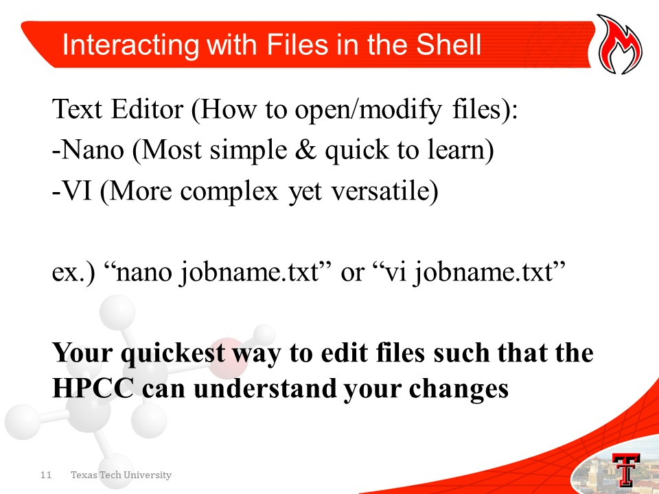
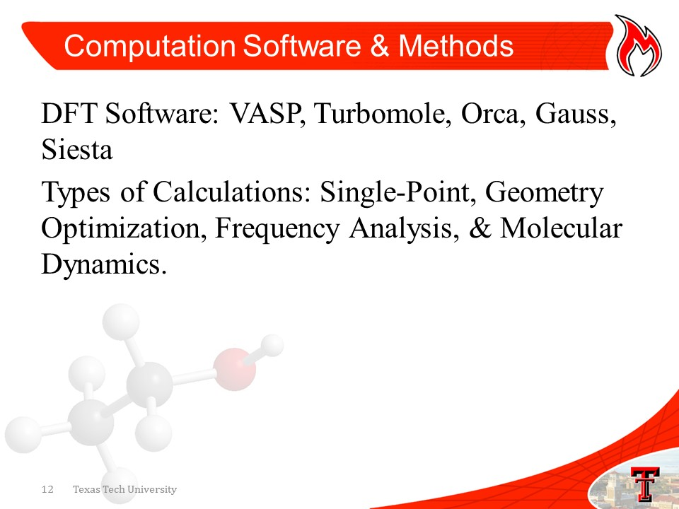
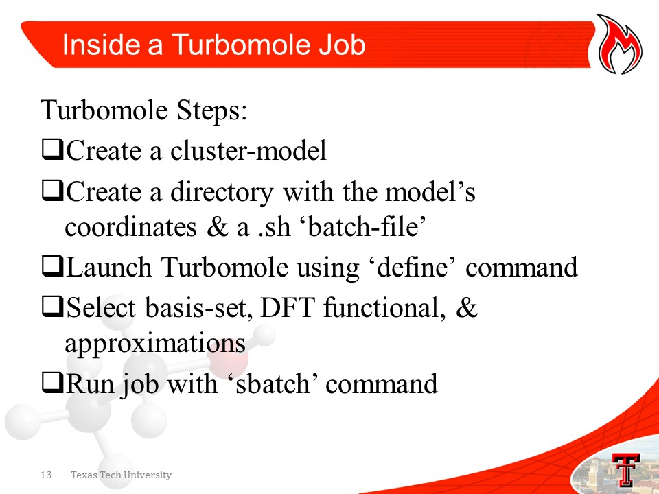
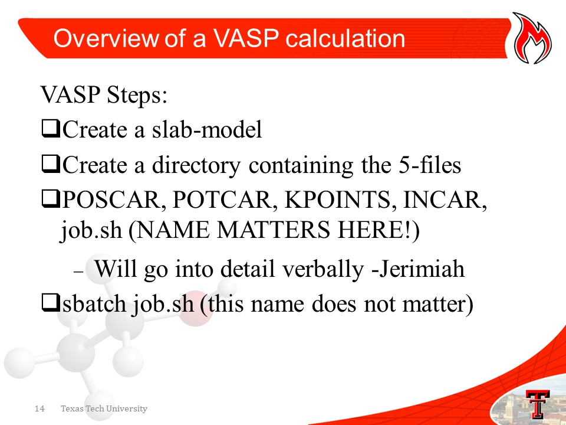
